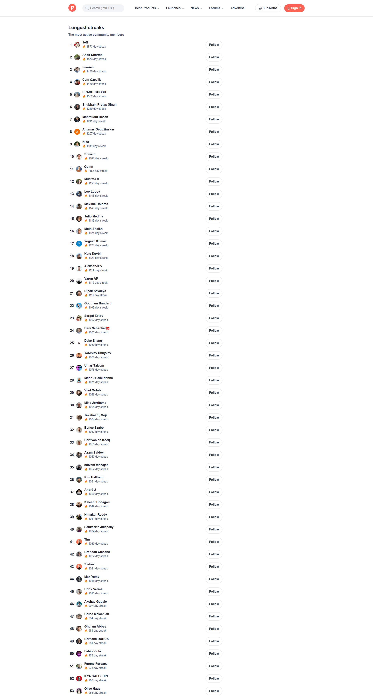
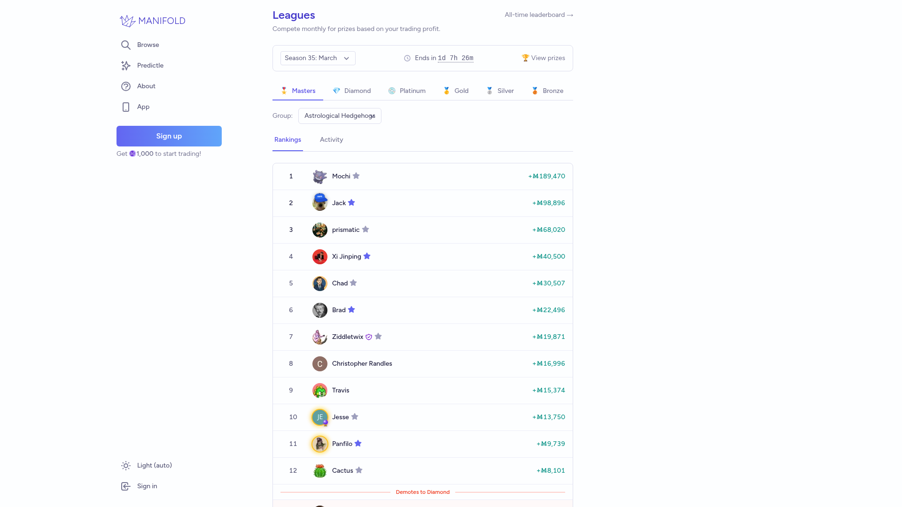

# Design Brainstorm: Signals Evidence Cockpit

## TL;DR
+Prototype a “mission board” model: signals earn readiness tiers like game/community rankings, then open into a SecOps-style investigation receipt. This keeps Prime OS serious while making evidence prioritization more instantly legible.

## Current State

*Current Signals cockpit.*

## Which Ideas to Prototype
| Idea | Novelty | Feasibility | Verdict |
|---|---|---|---|
| Mission lanes: Ready / Watch / Blocked / Learning | Medium | High | Prototype |
| Evidence receipt timeline | Medium | High | Prototype |
| Signal leaderboard rank badges | High | Medium | Explore |
| Heatmap mini-strip by family/freshness | High | Medium | Explore |

## Cross-Pollination Ideas

### From Security: Panther

*Panther — alert triage with severity, investigation evidence, and action path. [Lazyweb]*

**Pattern:** Investigation-first detail panel.
**Applied Here:** selected signal gets a receipt: source, strength, linked entity, guardrail, conversion route.
**Why It's a Zag:** commerce dashboards rarely borrow security triage rigor.

### From Social/Gamification: Product Hunt

*Product Hunt — ranked streak leaderboard with identity and action per row. [Lazyweb]*

**Pattern:** rank makes priority obvious.
**Applied Here:** signal rows get rank + tier badges, but no gamey aesthetic.
**Why It's a Zag:** turns evidence quality into a scan pattern, not a spreadsheet.

### From Prediction Markets: Manifold

*Manifold — league table with filters, rankings, and performance multipliers. [Lazyweb]*

**Pattern:** filtered ranking with performance signals.
**Applied Here:** filter by family/freshness/route while keeping strength prominent.

## Sketch
```txt
┌ Signal Mission Board ─────────────────────────────────────┐
│ Ready 12 │ Watch 3 │ Blocked 2 │ Learning 4              │
├───────────────────────┬──────────────────────────────────┤
│ #1 Attribution 95%    │ Evidence receipt                 │
│ #2 COS guardrail 92%  │ Source → Entity → Guardrail → CTA│
│ #3 Market 86%         │ [Convert to decision] [Audit]    │
└───────────────────────┴──────────────────────────────────┘
```
