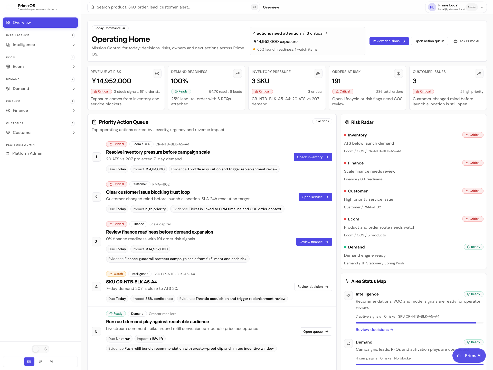
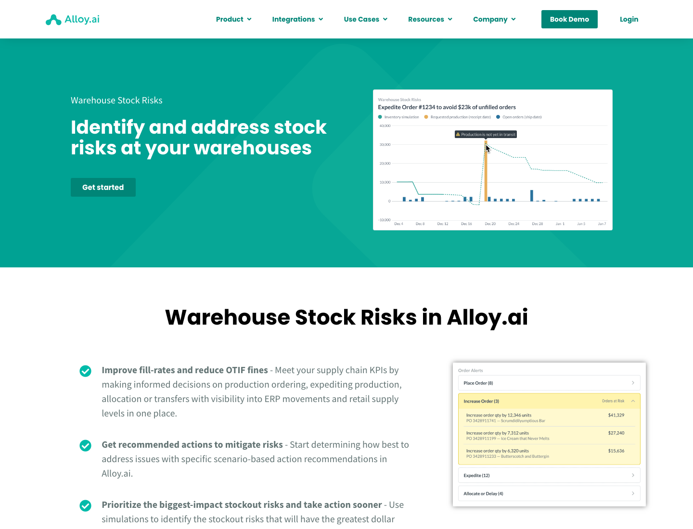
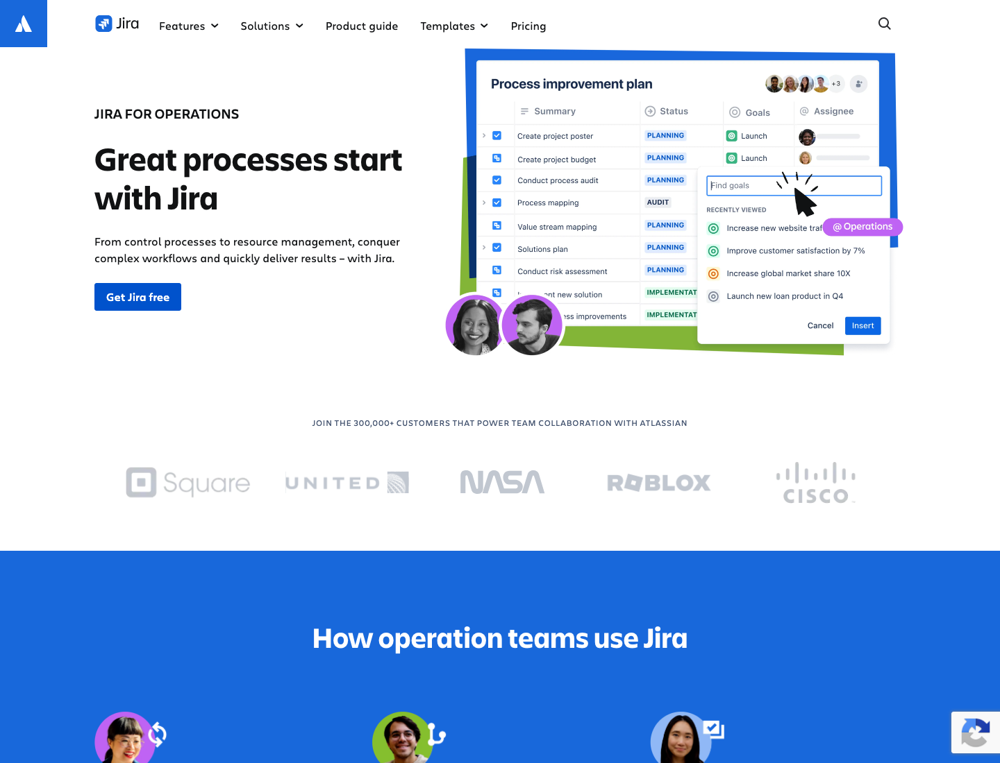
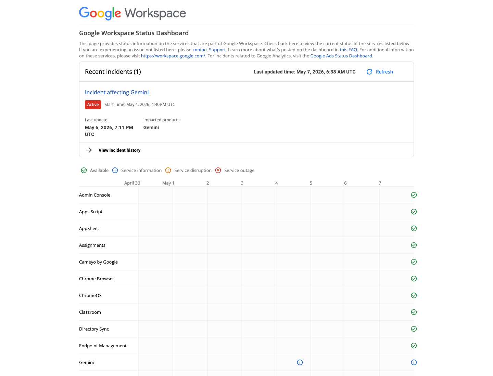

# Design Improvement: PrimeOS Operating Home

## TL;DR
The page already has strong operational density, but the hierarchy feels flat: every card competes equally. The highest-impact improvement is to turn the top of the page into a clearer command cockpit: one outcome strip, one primary action lane, then supporting risk/evidence panels.

## Current State

*PrimeOS Operating Home: left navigation, global search, top KPI cards, priority action queue, risk radar, area status map, evidence stack, and recent events.*

## Improvement Ideas

### 1. Make The Top Band A True Command Cockpit ⭐
Move the key decision summary into a bold, compact command strip with clearer status grouping: **Critical exposure**, **Ready to act**, **Blocked areas**, **Primary next action**. Keep the KPI cards, but make them secondary to one executive-read line.

**Inspired by:**

*Alloy — focuses warehouse risk around a clear stock-risk use case, then routes operators toward issue resolution. [Web + Lazyweb]*

**Why this works:** PrimeOS is cross-area operations software. The current top section has many metrics, but the operator still has to scan. A command strip would answer: “What matters now, why, and what do I do first?”

**Sketch:**
```text
┌ Operating Home ─────────────────────────────────────────────┐
│ Critical exposure ¥14.9M  │ 4 actions │ 3 critical │ 1 owner gap │
│ Primary next action: Resolve inventory pressure             │
│ [Check inventory →] [Review finance →] [Ask Prime AI]        │
└──────────────────────────────────────────────────────────────┘
┌ Revenue Risk ┐ ┌ Demand Ready ┐ ┌ Inventory ┐ ┌ Orders ┐ ┌ Issues ┐
```

### 2. Convert Priority Queue Into A Worklist With Stronger Ownership
Give each priority row a visible owner/avatar, domain color rail, SLA/deadline, and current blocker. Keep evidence chips, but add a “why now” sentence and reduce chip noise.

**Inspired by:**

*Jira Operations — frames operations work around ownership, views, forms, automation, and reports. [Web + Lazyweb]*

**Why this works:** PrimeOS operators need accountability, not only severity. Ownership and blocker state will make the queue more executable for cross-area work.

**Sketch:**
```text
┌ Priority Action Queue ───────────────────────────────────────┐
│ #1 │ Inventory │ Resolve pressure before campaign scale      │
│    │ Owner: Ecom Ops · SLA today · Blocker: ATS mismatch     │
│    │ Why now: 20 ATS vs 207 demand; ¥4.1M exposure           │
│    │ [Evidence] [Replenishment review]        [Check inv →]  │
└──────────────────────────────────────────────────────────────┘
```

### 3. Make Risk Radar More Visual And Less List-Like
Replace the right-side risk list with a compact radar: severity by Area, blocked dependency arrows, and one expandable detail per risk. Use red only for truly critical items; use amber/green for watch/ready.

**Inspired by:**

*Google Workspace Status Dashboard — uses a matrix/status language so incidents and healthy services are scannable at a glance. [Web + Lazyweb]*

**Why this works:** PrimeOS spans Demand, Customer, Ecom/COS, Intelligence, Finance. A status matrix makes cross-area health easier to parse than stacked rows.

**Sketch:**
```text
┌ Risk Radar ─────────────────────────────┐
│ Area        Now      Dependency          │
│ Ecom/COS    CRIT     Inventory → Orders  │
│ Finance     CRIT     Scale capital       │
│ Customer    CRIT     Service trust       │
│ Demand      READY    Campaign engine     │
│ Intelligence READY   Decision evidence   │
└─────────────────────────────────────────┘
```

### 4. Merge Evidence + Events Into A Timeline Of Proof
The Evidence Stack and Recent Operating Events are useful, but separated. Turn them into a chronological “proof timeline” with filters: Evidence, Event, Decision, Owner Action.

**Inspired by:**

*Google Workspace Status Dashboard — incident history and status evidence stay close to health state. [Web + Lazyweb]*

**Why this works:** Operators need auditability. A unified proof timeline connects “why the system recommends this” with “what just happened.”

**Sketch:**
```text
┌ Operating Proof Timeline ───────────────────────────────────┐
│ [Evidence] Inventory risk detected — CR-NTB...              │
│ [Event] Order captured — ord_xg4810ts                       │
│ [Decision] Throttle acquisition recommended                 │
│ [Owner] Finance review queued                               │
└──────────────────────────────────────────────────────────────┘
```

### 5. Add A Density Toggle For Operator Modes
Add mode tabs: **Command**, **Investigate**, **Audit**. Command shows only top actions and health; Investigate expands evidence; Audit prioritizes event/proof history.

**Inspired by:**

*Google status views separate incidents, product status, and history with a clear operational reading mode. [Web]*

**Why this works:** The current screen is dense and good for power users, but the same density is not ideal for every task. Modes let PrimeOS stay scalable without hiding important data.

**Sketch:**
```text
[Command] [Investigate] [Audit]
Command: top actions + risk map
Investigate: evidence cards + linked records
Audit: chronological events + decision log
```

## What's Working
- Strong domain coverage: Demand, Customer, Ecom/COS, Intelligence, Finance all appear on one operating surface.
- Good operational vocabulary: exposure, readiness, SLA, risk, evidence, and next action are already present.
- Priority queue structure is useful: severity + impact + evidence + CTA creates a good base for execution.
- Sidebar and global search create a credible product shell, not a standalone demo.

## All References
- `current.png` — PrimeOS Operating Home current screenshot.
- `alloy-stock-risks.png` — warehouse stock-risk pattern for focusing command intent.
- `jira-operations.png` — operations work management and ownership framing.
- `google-status-dashboard.png` — status matrix and incident-health language.

## Source Notes
Lazyweb searches used: enterprise operations command center dashboard, SaaS admin dashboard priority queue risk alerts, operations dashboard priority action queue. Live web screenshots were captured from Alloy, Atlassian Jira, and Google Workspace Status Dashboard.
