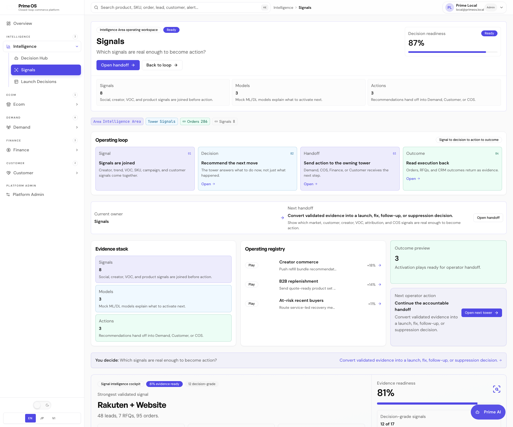
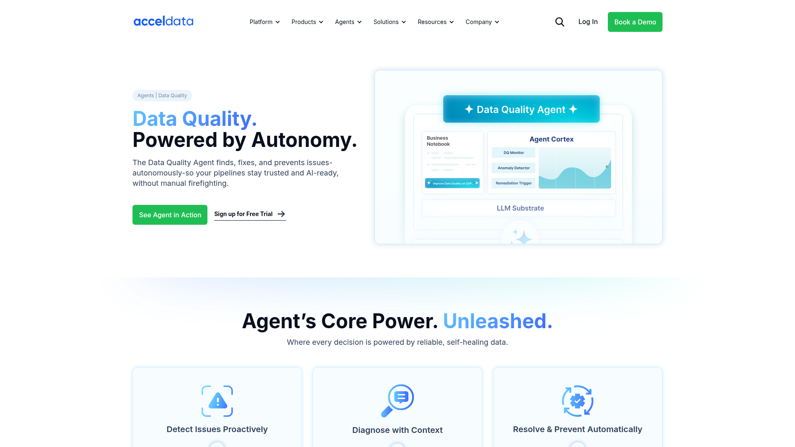
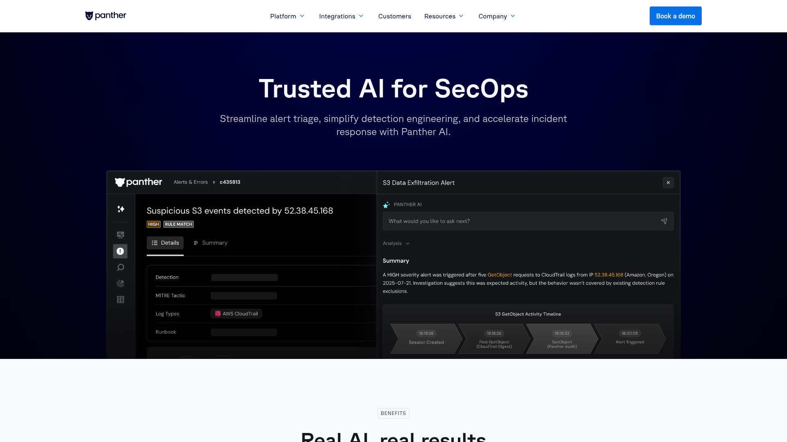
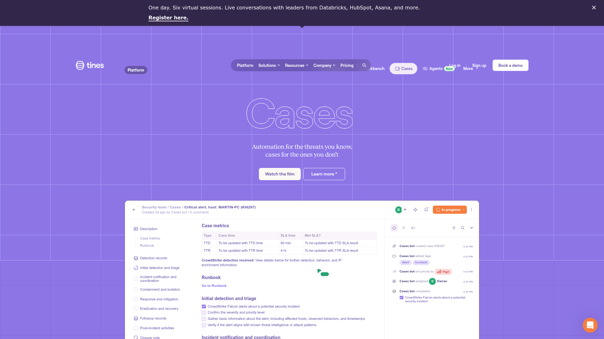

# Design Research: Signals Evidence Cockpit

## TL;DR
+Signals should feel less like a registry table and more like an evidence triage cockpit. Best patterns: a ranked evidence queue, freshness/quality status, selected-detail investigation panel, and an explicit conversion path into decisions.

## Current State

*Prime OS Intelligence → Signals after first cockpit pass.*

## Recommendations / Next Steps
1. **Add triage lanes above the workbench** — group signals by `Ready`, `Watch`, `Blocked`, `Learning`; inspired by SecOps/case dashboards.
2. **Add evidence timeline in detail panel** — show source → linked entity → guardrail → conversion as a compact chain.
3. **Add quick filters** — family, strength, freshness, route; avoid forcing scan of the full table.
4. **Add confidence explanation copy** — explain why `86%` means decision-grade; reduce magic-number feel.

## Key Examples

*Acceldata — proactive issue detection, contextual diagnosis, prevention cards. [Lazyweb]*

*Panther — SecOps alert triage with high-priority context, evidence, and investigation path. [Lazyweb]*

*Tines — cases dashboard with sidebar-style case list, status indicators, tags, and automation CTA. [Lazyweb]*

## Patterns
- Triage before detail: show what is actionable first.
- Quality/freshness visible at the same level as item name.
- Detail panel explains why the item matters, not only raw metadata.
- Conversion CTA must be explicit and auditable.

## Anti-Patterns
- Flat registry where all rows look equal.
- Metrics that count activity but do not explain readiness.
- AI or automation CTA without guardrail copy.

## Sources
- Lazyweb: Acceldata, Panther, Tines screenshots.
- Web: data quality monitoring, security triage, and evidence freshness best-practice search results reviewed on 2026-05-06.
