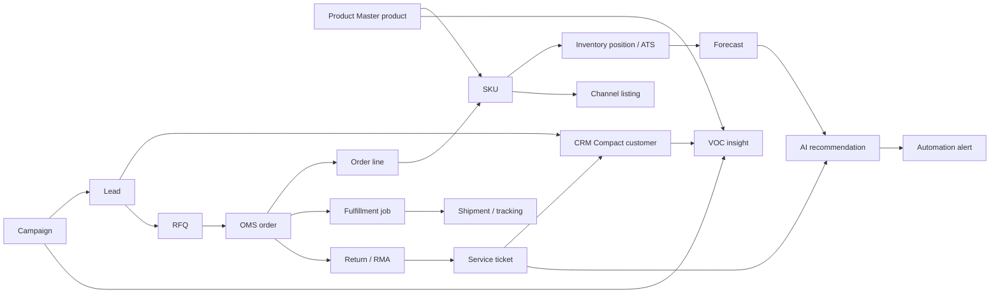

# 04 - Mock Data Linkage

## Backbone rule

COS mock data is the backbone. New Prime OS data is generated by reading existing COS stores through `src/lib/prime/prime-data.ts`. The new data should never be interpreted as a separate production data model.

## Source stores

| COS source | Entities used | Prime OS usage |
|---|---|---|
| `product-store.ts` | Product, SKU, price, media, channel listing hints | Campaign targeting, Commerce Surface RFQ, forecast SKU labels |
| `listing-store.ts` | Marketplace listing rows | Acquisition and channel proof |
| `inventory-store.ts` | Inventory position, ATS | Forecast risk, retargeting suppression, inventory alerts |
| `warehouse-store.ts` | Warehouse nodes | OMS/Fulfillment context and system metrics |
| `order-store.ts` | Order, order item, order event | CRM Compact, RFQ conversion, attribution, Event & Audit |
| `fulfillment-store.ts` | Fulfillment job, job item, shipment, tracking event, exception | Fulfillment proof, Event & Audit, alert context |
| `return-store.ts` | Return item / RMA | Service ticket, customer timeline, VOC |
| `demo-data-seeder.ts` | Seed orchestration | Runtime bootstrapping for BOD demo |

## Generated linked entities

| Prime entity | Generated from | Required linkage |
|---|---|---|
| Campaign | Products, listings, orders, inventory | `campaign.productId`, `campaign.skuId`, revenue proof from orders |
| Lead | Campaign + customer candidate | `lead.campaignId`, `lead.customerId`, `lead.productId`, `lead.skuId` |
| RFQ | Lead + OMS/order items | `rfq.leadId`, `rfq.customerId`, `rfq.skuId`, optional `rfq.orderId` |
| Customer profile | OMS orders + generated lead context | `customer.lastOrderId`, timeline from order events |
| Service ticket | Returns/RMA + OMS orders | `ticket.customerId`, `ticket.orderId`, `ticket.rmaId` |
| VOC insight | Products + customers + campaigns + tickets | `voc.productId`, `voc.customerId`, `voc.campaignId` |
| Forecast | Products + inventory + campaign demand | `forecast.skuId`, ATS via `getTotalATS` |
| AI recommendation | Forecast + ticket + campaign context | target points to SKU, ticket, or campaign |
| Alert | Recommendation + area context | `alert.linkedEntity`, `alert.recommendationId` |

## Relationship map

## Mock data generated mới

Representative static data is captured in `/packages/mock-data/prime-linked-data.json`. Runtime data is generated in the web app through `getPrimeSnapshot()`, so UI screens always read the current COS in-memory stores after seeding.

## Do not create

- Dashboard-only data that has no product, SKU, customer, campaign, order, or alert reference.
- Customer records without order, lead, or service timeline.
- AI messages without linked entity context.
- Campaign analytics without RFQ/order/forecast linkage.
