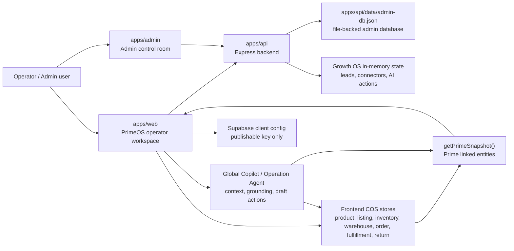
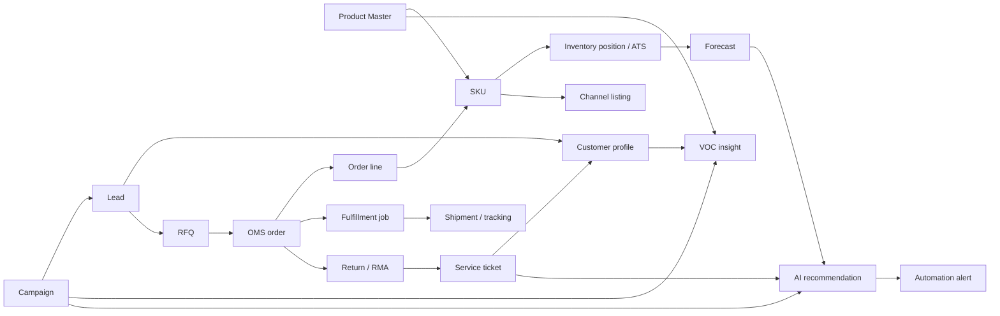

# PrimeOS - Mô tả chi tiết toàn bộ hệ thống

Ngày cập nhật: 2026-06-08  
Phạm vi: mô tả hệ thống PrimeOS trong repository hiện tại, gồm product thesis, kiến trúc service, frontend, backend, admin, data, AI operator, bảo mật, CI/CD, testing và roadmap.

## 1. Tóm tắt điều hành

PrimeOS là prototype "commerce operating system + intelligence layer" cho Prime Commerce. Hệ thống không chỉ là CRM, OMS, dashboard, agency tool hay SaaS điểm lẻ. PrimeOS kết nối market signal, demand, customer context, e-commerce execution, finance readiness và AI operator thành một vòng vận hành liên tục.

Trong Phase 1, PrimeOS được xây trên một monorepo nhỏ:

- `apps/web`: ung dung operator workspace chinh, React/Vite.
- `apps/admin`: admin control room de quan tri curated data.
- `apps/api`: Express API file-backed cho auth, IAM, admin CRUD va Growth OS runtime.
- `packages/mock-data`: hop dong mock-data lien ket giua Prime entities va COS entities.
- `docs`: tai lieu product, migration, operations, platform, ADR va QA.
- `references`, `research`, `ppt`, `outputs`: prototype, report, research va artifact trinh bay.

Thông điệp sản phẩm chính:

- Demand tao opportunity.
- Customer giu ngu canh.
- Ecom/COS thuc thi.
- Intelligence hoc va toi uu.
- Finance bien commerce evidence thanh funding readiness.
- COS la control core cua he thong.

## 2. Nguyên tắc hệ thống

PrimeOS hiện tại là Phase 1 prototype/staging-ready visualization, không phải backend production đầy đủ cho tất cả domain commerce.

Nguyên tắc cốt lõi:

- COS mock data la backbone. Prime entities duoc sinh ra bang cach doc Product, SKU, Inventory, Orders, Fulfillment, Returns va Events.
- Moi insight phai co lien ket nguoc ve entity that trong COS context neu co the.
- AI/agent khong la system of record. AI doc ngu canh, giai thich, goi y, chuan bi draft va route viec; khong tu dong ghi business state.
- Admin control room la data plane rieng, phuc vu curated seed/admin data va quyen quan tri.
- Web operator workspace la noi nguoi dung van hanh PrimeOS theo area/tower/floor.
- Backend hien tai uu tien prototype security: bearer session token, CORS allowlist, role/read-write boundary, file-backed JSON persistence.

## 3. Bản đồ kiến trúc tổng quan



## 4. Service layout

PrimeOS chay nhu ba service ung dung:

| Service | Thu muc | Vai tro | Local dev | Docker/production |
| --- | --- | --- | --- | --- |
| Web | `apps/web` | Operator workspace chinh | `http://127.0.0.1:5177` | container web, expose `5173:80` |
| Admin | `apps/admin` | Data control room/admin CRUD | `http://127.0.0.1:5174` | container admin, expose `5174:80` |
| API | `apps/api` | Auth, IAM, admin resource CRUD, Growth OS API | `http://127.0.0.1:8180` | container api, private Docker service `api:8080` |

Local development:

```bash
npm run dev:api
npm run dev:web
npm run dev:admin
```

Verification scripts tu root:

```bash
npm run test:api
npm run test:web
npm run test:web:smoke
npm run lint:web
npm run build:web
npm run build:admin
```

## 5. Monorepo và package structure

Root `package.json` khai bao workspaces:

- `apps/*`
- `packages/*`

Root scripts dieu phoi cac workspace:

- `dev:web`, `dev:admin`, `dev:api`
- `build:web`, `build:web:dev`, `build:admin`
- `test:web`, `test:web:smoke`, `test:api`
- `lint:web`

Ung dung web dung:

- React 18
- Vite 6
- TypeScript
- React Router
- TanStack Query
- Radix UI primitives
- lucide-react
- Recharts
- Supabase JS client
- Vitest
- Playwright

Ung dung admin dung:

- React 18
- Vite 6
- TypeScript
- lucide-react

Backend API dung:

- Node ESM
- Express
- CORS
- Node built-in crypto/fs APIs
- `node --test`

## 6. Frontend operator workspace (`apps/web`)

### 6.1 App shell

Entry chinh:

- `apps/web/src/App.tsx`
- `apps/web/src/routes/PrimeRoutes.tsx`
- `apps/web/src/components/layout/AppLayout.tsx`
- `apps/web/src/components/layout/AppSidebar.tsx`

Provider stack:

- `QueryClientProvider`: TanStack Query, stale time 60s, retry 1, khong refetch khi window focus.
- `ThemeProvider`: theme key `prime-os-genesis-theme`.
- `I18nProvider`: ngon ngu UI.
- `AuthProvider`: Prime backend session.
- `TooltipProvider` va `Sonner`: UX utilities.
- `BrowserRouter` + `Routes`: routing.

Auth gate:

- Route `/auth` redirect ve `/overview`.
- Root `/` redirect ve `/overview`.
- Moi route chinh nam trong `RequireAuth` + `AppLayout`.
- Khi dang restore session, UI hien `Loading PrimeOS...`.

App shell gom:

- Sidebar chinh voi cac module: Performance, Demand, Scheduled, COS, Service, Connectors, Finance.
- Command palette.
- Workspace tab bar va tab content host.
- Global Copilot workspace.
- Global search result theo Area, Tower, Floor, Product, SKU, Order, Lead, Customer, RFQ, Campaign, Alert.

### 6.2 Routing

PrimeOS dung `PrimeRoutes()` de map route cu va route moi vao product surfaces.

Nhom route chinh:

| Area | Route | Man hinh |
| --- | --- | --- |
| Overview/Performance | `/overview` | `PrimeGrowthOSPage` |
| Account/Admin setup | `/account` | `Account` |
| Demand | `/demand`, `/demand/hub` | Demand hub |
| Demand | `/demand/mdec` | MDEC |
| Demand | `/demand/sources` | Demand sources |
| Demand | `/demand/campaigns` | Campaign workspace |
| Demand | `/demand/content-social` | Content & Social |
| Demand | `/demand/leads-rfqs` | Leads & RFQs |
| Demand | `/demand/re-engage` | Retargeting/Re-engage |
| Customer | `/customer/crm-compact` | CRM Compact/Customer Profile |
| Customer | `/customer/service` | Service |
| Finance | `/finance/fin-support` | Finance Support |
| Ecom | `/ecom/commerce-surface` | Commerce Surface |
| COS | `/ecom/cos/product-master` | Products/Product Master |
| COS | `/ecom/cos/listings` | Listings |
| COS | `/ecom/cos/inventory-brain` | Inventory |
| COS | `/ecom/cos/warehouses` | Warehouses |
| COS | `/ecom/cos/oms` | Orders/OMS |
| COS | `/ecom/cos/fulfillment` | Fulfillment |
| COS | `/ecom/cos/returns` | Returns |
| COS | `/ecom/cos/policy-rule` | Policy & Rule |
| COS | `/ecom/cos/event-audit` | Event & Audit |
| Intelligence | `/intelligence/consulting-agent` | Consulting Agent |
| Intelligence | `/intelligence/product-operation-agent` | Operation Agent |
| Intelligence | `/intelligence/branding-agent` | Branding Agent |

Legacy redirects giu kha nang dieu huong tu route cu:

- `/dashboard` -> `/overview`
- `/products` -> `/ecom/cos/product-master`
- `/inventory` -> `/ecom/cos/inventory-brain`
- `/orders` -> `/ecom/cos/oms`
- `/fulfillment` -> `/ecom/cos/fulfillment`
- `/returns` -> `/ecom/cos/returns`
- `/sla-policies` -> `/ecom/cos/policy-rule/sla`
- `/routing-plans` -> `/ecom/cos/policy-rule/routing`

### 6.3 Navigation model

`apps/web/src/lib/prime/prime-navigation.ts` dinh nghia cay navigation theo `overview`, `area`, `tower`, `floor`.

Navigation hien tai gom:

- Performance
- Intelligence
  - Operation Agent: Command Center, Operating Kanban, Agent Queue, Audit
  - Branding Agent: Dashboard, Brand Library, My Assets, Create New
  - Consulting Agent: KPI Dashboard, Signals Board, Launch Decisions
- Ecom
  - COS Ops: Products, Inventory Brain, Orders, Fulfillment, Policy & Rule, Event & Audit
- Demand
  - Demand Dashboard
  - MDEC: Main, Workflow, Insight
  - Sources: Marketplace, Social, Ads, Partner, Manual Import
  - Campaigns: Overview, Pipeline, Planner, Readiness, Execution Queue, Results
  - Content & Social
  - Leads & RFQs
  - Re-engage
- Finance
  - Fin Support
- Customer
  - Customer Profile: Account Profile, Identity Matching
  - Service
- Admin Setup

Ham `getPrimeNavPath()` chon active route dua tren pathname/search/hash, uu tien match cu the hon.

## 7. Product domain map

### 7.1 Performance / Growth OS overview

Route: `/overview`  
File: `apps/web/src/pages/prime/PrimeGrowthOSPage.tsx`

Day la cockpit dau tien cho user. Man hinh nay gom:

- KPI tong quan: leads, conversion, revenue, service bookings, repeat rate, AI actions.
- Module cards: Lead/Demand, CRM & Follow-up, Commerce, Service, Connectors, Dashboard, AI Agent.
- Problem cards: scattered leads, inconsistent follow-up, weak CRM data, disconnected operations, limited visibility, poor customer experience.
- Funnel: generated -> qualified -> engaged/followed-up -> converted -> retained.
- Journey loop: attract -> convert -> delight -> retain -> grow.
- Leads table va thao tac tao lead/move stage/log follow-up.
- Connector list voi setup/test/connect/disconnect.
- AI action approval.
- Finance/COS/Service/Connectors module views.

Data lay tu:

- `fetchGrowthOsSnapshot()` qua `/api/public/growth-os` hoac `/api/growth-os`.
- `fallbackGrowthOsSnapshot` neu backend chua chay.
- Backend mutation cho leads/connectors/AI actions khi co token.

### 7.2 Demand Area

Demand Area bien tin hieu thi truong thanh lead, RFQ, campaign va customer context.

Thanh phan chinh:

- Demand Dashboard: overview ve health, sources, queue, next actions.
- MDEC: Multi-channel Demand Engagement Center, gom dashboard, calendar, composer, approvals, engagement, escalations, analytics, listening, reports.
- Sources: marketplace, social, ads, partner, manual import.
- Campaigns: campaign plan, budget, readiness, execution queue, result.
- Content & Social: creator brief, content calendar, approvals, publishing queue.
- Leads & RFQs: inbound leads, form/message capture, RFQ intake, assignment, CRM handoff.
- Re-engage: retargeting audience, outreach sequence, suppression rules, promo push.

Entities lien quan:

- `PrimeCampaign`
- `PrimeLead`
- `PrimeRfq`
- `PrimeCustomer`
- Product/SKU/listing/order context tu COS

### 7.3 Customer Area

Customer Area co chu truong compact, khong tach qua nhieu tower enterprise CRM.

Tower:

- CRM Compact / Customer Profile
- Service

CRM Compact giu:

- account/customer identity
- profile
- contact/timeline
- segmentation
- lifecycle
- notes
- follow-up
- loyalty lite
- B2B account extension
- identity matching

Service giu:

- ticket queue
- case detail
- RMA
- SLA
- resolution
- link ve OMS, Returns, Fulfillment va CRM timeline

### 7.4 Ecom Area và COS Tower

COS la control core manh nhat cua Phase 1. COS khong bi PrimeOS thay the; PrimeOS boc no trong shell moi va dung no lam nguon execution truth.

COS floors:

| Floor | Route | Vai tro |
| --- | --- | --- |
| Product Master | `/ecom/cos/product-master` | SSOT cho identity, pricing, media, variants, compliance |
| Listings | `/ecom/cos/listings` | Trang thai marketplace listing rieng voi Product Master |
| Inventory Brain | `/ecom/cos/inventory-brain` | ATS, reservations, inventory position |
| Warehouses | `/ecom/cos/warehouses` | topology kho: internal, FBA, FBS, 3PL, virtual |
| OMS Orchestration | `/ecom/cos/oms` | order status va lifecycle |
| Fulfillment Control | `/ecom/cos/fulfillment` | jobs, job items, shipments, tracking, exceptions |
| Returns | `/ecom/cos/returns` | RMA, QC, disposition, refund |
| Policy & Rule | `/ecom/cos/policy-rule` | SLA, routing guardrail |
| Event & Audit | `/ecom/cos/event-audit` | trace cua order, tracking, service, alert, recommendation |

Commerce Surface (`/ecom/commerce-surface`) dung cho storefront/RFQ/assisted commerce/pricing/checkout concept, nhung khi RFQ duoc convert thi execution duoc ban giao ve COS/OMS.

### 7.5 Intelligence Area

Intelligence doc market/customer/COS signals va bien chung thanh decision.

Tower:

- Operation Agent: command center, operating kanban, agent queue, audit.
- Branding Agent: brand dashboard, library, assets/integrations, create flow.
- Consulting Agent: KPI dashboard, signals board, launch decisions.
- Analytics: KPI model, funnel health, execution health, service health.
- Attribution: source, lead, order, issue attribution.
- Forecasting & Optimization: demand forecast, ATS risk, replenishment suggestion, campaign throttle.
- Social Listening & VOC: listening queue, sentiment, root cause, product/campaign action.
- Automation & Alerts: alert queue, routing, escalation, automation guardrail.

Data model lien quan:

- `PrimeVocInsight`
- `PrimeForecast`
- `PrimeSocialStream`
- `PrimeInsightModel`
- `PrimeActivationPlay`
- `PrimeRecommendation`
- `PrimeAlert`

### 7.6 Finance Area

Route: `/finance/fin-support`  
File: `apps/web/src/pages/prime/PrimeFinSupportPage.tsx`

Finance khong claim "loan approval" hay "digital bank". Ngon ngu dung la funding readiness, evidence package, bank partner review route.

Fin Support gom:

- overview readiness
- commerce evidence
- documents
- review routes
- applications
- audit
- finance trust profile
- bank-reviewable evidence pack
- risk blockers va fix recommendations

Finance doc ngu canh tu:

- fulfilled orders
- shipment/tracking proof
- receivables/settlement concept
- customer/order quality
- risk/trust profiles
- partner workspace summary

### 7.7 Admin Setup / Account

`/account` va API `/api/v1/*` phuc vu account/workspace/IAM:

- user profile
- workspace info
- role definitions
- workspace members
- invitations
- deactivate/reactivate member
- account audit events

## 8. Data architecture và source of truth

### 8.1 Các lớp dữ liệu

PrimeOS hien co bon lop du lieu chinh:

1. Frontend COS in-memory stores.
2. Prime linked snapshot generated tu COS stores.
3. Backend admin file-backed database.
4. Growth OS backend/fallback state.

Ngoai ra co Supabase client config, nhung auth/runtime hien tai cua PrimeOS khong dua vao Supabase session. Supabase key trong frontend phai la publishable/anon key, khong duoc la service-role key.

### 8.2 Frontend COS stores

| Store | File | Entity | Vai tro |
| --- | --- | --- | --- |
| Product Store | `apps/web/src/lib/product-store.ts` | Product, SKU, channel hints | Product Master SSOT |
| Listing Store | `apps/web/src/lib/listing-store.ts` | Listing | Channel marketplace state |
| Inventory Store | `apps/web/src/lib/inventory-store.ts` | InventoryPosition | ATS va ton kho kha dung |
| Warehouse Store | `apps/web/src/lib/warehouse-store.ts` | Warehouse | Kho va capabilities |
| Order Store | `apps/web/src/lib/order-store.ts` | Order, OrderItem, OrderEvent | OMS lifecycle va events |
| Fulfillment Store | `apps/web/src/lib/fulfillment-store.ts` | Job, JobItem, Shipment, TrackingEvent, Exception | Fulfillment execution |
| Return Store | `apps/web/src/lib/return-store.ts` | ReturnItem/RMA | Returns, QC, refund |
| Demo Seeder | `apps/web/src/lib/demo-data-seeder.ts` | Cross-store seed | Khoi tao demo data cho BOD/demo |

Product Store comment noi ro:

- Product Master so huu identity, pricing, media, variants.
- Inventory khong nam trong Product Master ma do Inventory Tower tinh.
- Order state do OMS giu.
- Fulfillment do Fulfillment Tower giu.

### 8.3 Prime linked snapshot

`apps/web/src/lib/prime/prime-data.ts` doc cac store COS va tao `PrimeSnapshot`.

`PrimeSnapshot` gom:

- products
- orders, orderItems, orderEvents
- inventoryPositions
- listingsCount
- warehousesCount
- fulfillmentJobsCount
- shipmentsCount
- trackingEventsCount
- returnsCount
- campaigns
- leads
- rfqs
- customers
- tickets
- vocInsights
- alerts
- recommendations
- forecasts
- socialStreams
- insightModels
- activationPlays
- demoFlows
- metrics

Metrics hien co:

- revenue
- opportunityValue
- leadToOrderRate
- openIssues
- highRiskAlerts
- cosStrength

### 8.4 Admin database

Backend file-backed database:

- path: `apps/api/data/admin-db.json`
- seed source: `apps/api/src/seed.js`
- store logic: `apps/api/src/store.js`

Store co:

- resource allowlist
- required fields per resource
- numeric field validation
- atomic write qua tmp file + rename
- write queue/lock de tranh concurrent write conflict
- normalize legacy aliases
- reset seed data

Admin resource keys:

- `intelligenceCreators`
- `intelligenceCustomers`
- `launchDecisions`
- `products`
- `listings`
- `inventoryBrain`
- `warehouses`
- `omsOrders`
- `fulfillmentControl`
- `policies`
- `eventAudit`
- `campaignOps`
- `contentCreatorOps`
- `leadResponseCapture`
- `retargetingOutreach`
- `capitalReadiness`
- `capitalOffers`
- `riskTrust`
- `settlementRepayment`
- `financePortfolio`
- `crmCompact`
- `serviceDesk`
- `admins`
- `users`

### 8.5 Growth OS state

`apps/api/src/growth-os.js` giu state in-memory cho:

- metrics
- modules
- problemCards
- funnel
- journeyLoop
- competitors
- leads
- commerceOrders
- serviceBookings
- connectors
- aiActions
- packages
- updatedAt

Mutations hien tai:

- create lead
- move lead stage
- log lead follow-up
- test connector setup
- connect connector
- disconnect connector
- approve AI action

Frontend `apps/web/src/lib/prime/growth-os.ts` co fallback snapshot khi backend khong available.

### 8.6 Relationship map



## 9. Core operating flows

`apps/web/src/lib/prime/prime-flow-registry.ts` dinh nghia cac operating flows lien area.

| Flow | Trigger | Output | Failure handling |
| --- | --- | --- | --- |
| Campaign to Lead | Campaign launch/source response | Qualified lead co product/SKU context | Suppress weak source, route Demand owner |
| RFQ to Order | RFQ quoted and accepted | OMS order linked customer/SKU/campaign | Escalate pricing/ATS exception |
| Order to Fulfillment | Order created/released | Shipment job, tracking event, settlement evidence | Exception queue + SLA reroute |
| Return to Refund | Customer return/service case | Closed RMA, inventory state, customer timeline | Service SLA escalation |
| Forecast to Replenishment | Forecast risk/demand spike | Replenishment recommendation | Alert Decision Hub, suppress risky launch |
| Receivable Readiness | Fulfilled order + settlement event | Bank partner review packet | Block funding eligibility until proof attached |

Demo flow BOD:

1. Campaign -> traffic -> lead capture -> CRM Compact.
2. Lead -> qualification -> B2B extension -> RFQ.
3. RFQ/assisted commerce -> order created -> OMS.
4. Order -> inventory reservation -> orchestration -> fulfillment -> shipment tracking.
5. Order issue -> service ticket -> return/complaint -> resolution -> customer timeline.
6. VOC/analytics/attribution/forecast/AI recommendation -> campaign adjustment/customer follow-up/ops alert.

## 10. Backend API (`apps/api`)

### 10.1 Runtime

API entry:

- `apps/api/src/server.js`

Local dev:

```bash
PRIME_ALLOW_DEMO_CREDENTIALS=true PRIME_SESSION_SECRET=prime-os-local-dev-session-secret PORT=8180 node --watch src/server.js
```

Production:

- `NODE_ENV=production`
- `PORT=8080`
- API container private trong Docker network.
- Reverse proxy/web/admin container proxy `/api`.

### 10.2 Security headers và CORS

API tat `x-powered-by` va set:

- `X-Content-Type-Options: nosniff`
- `Referrer-Policy: no-referrer`
- `Permissions-Policy: camera=(), microphone=(), geolocation=()`
- `X-Request-Id`

CORS:

- Local demo cho phep Vite dev/preview origins.
- Production dung `PRIME_ALLOWED_ORIGINS`.
- Allowed headers: `Authorization`, `Content-Type`.
- Methods: `GET`, `POST`, `PUT`, `DELETE`, `OPTIONS`.

### 10.3 Auth

Auth file:

- `apps/api/src/auth.js`

Co che:

- password hash bang `scryptSync`
- salt random
- constant-time compare qua `timingSafeEqual`
- session token payload base64url + HMAC SHA-256 signature
- session TTL default 8h
- revoke session server-side qua `revokedSessionIds`

Env bat buoc trong production:

- `PRIME_SESSION_SECRET`
- `PRIME_ADMIN_EMAIL`
- `PRIME_ADMIN_PASSWORD`
- `PRIME_USER_EMAIL`
- `PRIME_USER_PASSWORD`
- `PRIME_ALLOW_DEMO_CREDENTIALS=false`

Demo credentials chi nen dung local:

- Admin: `admin@primeos.local` / `Admin@PrimeOS2026!`
- User: `user@primeos.local` / `User@PrimeOS2026!`

Remote demo traffic bi chan neu demo credentials bat ma request khong den tu loopback.

### 10.4 Session và access model

Role:

- `admin`: full CRUD tat ca resources, co reset.
- `user`: read-only across visible PrimeOS resources, khong thay `admins`/`users`, khong write, khong reset.

Session response gom:

- role
- roleLabel
- description
- canReset
- canWrite
- visibleResources
- writableResources
- hiddenResources
- resourcePermissions
- account

IAM/account endpoints co capability checks:

- `account.profile.read_self`
- `account.profile.update_self`
- `workspace.read`
- `iam.members.read`
- `iam.members.invite`
- `iam.members.suspend`
- `iam.members.reactivate`
- `iam.roles.read`
- `iam.audit.read`

### 10.5 API endpoints

Public:

| Method | Path | Muc dich |
| --- | --- | --- |
| GET | `/health` | health check |
| GET | `/api/public/growth-os` | public Growth OS snapshot |
| POST | `/api/auth/login` | login |
| POST | `/api/auth/logout` | revoke bearer token neu co |

Authenticated:

| Method | Path | Muc dich |
| --- | --- | --- |
| GET | `/api/session` | restore session |
| GET | `/api/meta` | visible resource counts |
| POST | `/api/admin/reset` | reset seed data, admin only |
| GET | `/api/v1/me` | account envelope |
| PATCH | `/api/v1/me` | update display name |
| GET | `/api/v1/workspace` | workspace info |
| GET | `/api/v1/role-definitions` | role definitions |
| GET | `/api/v1/workspace-members` | members + pending invites |
| POST | `/api/v1/workspace-member-invitations` | invite member |
| POST | `/api/v1/workspace-members/:membershipId/deactivate` | suspend member |
| POST | `/api/v1/workspace-members/:membershipId/reactivate` | reactivate member |
| GET | `/api/v1/audit-events` | recent account audit events |
| GET | `/api/growth-os` | authenticated Growth OS snapshot |
| POST | `/api/growth-os/leads` | create Growth lead |
| POST | `/api/growth-os/leads/:leadId/stage` | move lead stage |
| POST | `/api/growth-os/leads/:leadId/follow-up` | log follow-up |
| POST | `/api/growth-os/connectors/:connectorId/test` | validate connector setup |
| POST | `/api/growth-os/connectors/:connectorId/connect` | connect channel |
| POST | `/api/growth-os/connectors/:connectorId/disconnect` | disconnect channel |
| POST | `/api/growth-os/ai-actions/:actionId/approve` | approve AI action |
| GET | `/api/:resource` | list resource |
| GET | `/api/:resource/:id` | get resource item |
| POST | `/api/:resource` | create resource item |
| PUT | `/api/:resource/:id` | update resource item |
| DELETE | `/api/:resource/:id` | delete resource item |

## 11. Admin control room (`apps/admin`)

Admin app la control room cho curated data operations. File chinh:

- `apps/admin/src/App.tsx`

Chuc nang:

- login bang Prime backend auth
- luu token trong `sessionStorage` key `prime-os-admin-token`
- doc `/api/session`, `/api/meta`, resource list
- CRUD resource theo quyen
- reset seed data neu admin
- search/filter/sort
- field editor theo config
- preview runtime href cho mot so resource
- group resources theo area

Resource groups:

| Group | Resources |
| --- | --- |
| Intelligence | creators, customers, launch decisions |
| Ecom | products, listings, inventory brain, warehouses, OMS orders, fulfillment control, policies, event audit |
| Demand | campaign ops, content creator ops, lead response capture, retargeting outreach |
| Finance | capital readiness, capital offers, risk trust, settlement repayment, finance portfolio |
| Customer | CRM compact, service desk |
| Identity | admins, users |

Moi `ResourceConfig` co:

- label/singular/description
- strategy
- evidence notes
- status key
- create default
- field configs
- title/meta mapping
- table columns

## 12. Prime AI / Copilot / Operation Agent

### 12.1 Boundary

ADR 0001-0003 dinh nghia boundary:

- UI surface: chat, quick prompts, citations, previews, confirmations, tool progress.
- Context gateway: read APIs/snapshots co source, freshness, citations.
- AI runtime: intent routing, grounding, response composition, confidence, fallback.
- Command gateway: schema-validated, permission-checked, confirmed, idempotent, audited mutations trong tuong lai.

Phase hien tai:

- deterministic frontend engine
- khong external LLM calls
- khong autonomous writes
- command dau tien chi la `product.prepare_create_draft`
- write action chi prefill form sau confirmation
- UI trace khong duoc coi la immutable business audit

### 12.2 Global Copilot

Files:

- `apps/web/src/hooks/use-global-copilot-engine.ts`
- `apps/web/src/lib/copilot/context.ts`
- `apps/web/src/lib/copilot/context-gateway.ts`
- `apps/web/src/lib/copilot/knowledge.ts`
- `apps/web/src/lib/copilot/response-composer.ts`
- `apps/web/src/lib/copilot/command-gateway.ts`
- `apps/web/src/components/copilot/*`

Engine lam:

- resolve context theo pathname
- build welcome message
- giu session-local conversation state: last domain, last intent, last entity ref
- phan loai prompt
- doc local stores/knowledge
- tao response co metadata
- expose quick prompts
- track telemetry: assistant count, clarify count, fallback count, last strategy/confidence

Response contract:

- `domain`
- `intent`
- `actions`
- `entityRef`
- `citations`
- `grounding`
- `debug`

Grounding gom:

- sources: `local_store`, `route_context`, `knowledge_base`, `session_memory`, `draft_prefill`
- citations
- retrievedAt
- freshness: `live_session`, `seed_snapshot`, `static_knowledge`, `unknown`
- confidence: high/medium/low
- policyTags: vi du `context-read-only`, `frontend-read-only-default`, `draft-before-commit`, `no-mutation`

### 12.3 Operation Agent

Route: `/intelligence/product-operation-agent`  
File: `apps/web/src/pages/prime/PrimeProductOperationAgentPage.tsx`

Views:

- Command Center
- Operating Kanban
- Agent Queue
- Audit

Operation Agent lam viec voi:

- operating cards
- severity
- approval state
- proposals
- policy checklist
- audit trail
- source route
- chat resolution
- queue approvals
- drag/move operating cards

Guardrail:

- tac vu duoc chuan bi va route
- high-impact mutation khong tu dong chay
- evidence va policy check luon hien trong detail

## 13. UI, design system và i18n

### 13.1 Design tokens

`apps/web/src/index.css` dinh nghia CSS variables cho:

- background/foreground/card/popover
- primary, secondary, muted, accent
- success, warning, destructive
- channel colors: Amazon, Shopee, Rakuten
- radius, header/sidebar sizes, row heights
- motion timings
- shadows
- surface tokens
- text tokens
- decision/status tokens
- area tokens: intelligence, demand, customer, ecom, finance

Co light va dark theme.

Typography:

- DM Sans cho body.
- General Sans cho heading/display.
- JetBrains Mono cho identifier.

### 13.2 Component/system conventions

Shared system components:

- DataTable
- StatusBadge
- PriorityBadge
- PageHeader
- SummaryMetricCard
- ActionToolbar
- FiltersBar
- EmptyState
- ConfirmDialog
- PageDataState
- ThemeModeSwitcher

Prime operating components:

- DecisionHeader
- OperatingLoop
- HandoffRail
- EvidenceStack
- OutcomePreview
- RegistryList
- LinkedEntityStrip
- OwnerSlaBadge

### 13.3 i18n

i18n files:

- `apps/web/src/lib/i18n/I18nContext.tsx`
- `apps/web/src/lib/i18n/dictionaries.ts`
- `apps/web/src/lib/i18n/shell-dictionaries.ts`
- `apps/web/src/lib/i18n/ops-dictionaries.ts`
- `apps/web/src/lib/i18n/format.ts`

Supported locale surfaces include:

- `vi-VN`
- `ja-JP`
- `en-US`

## 14. Auth frontend và backend base

Frontend auth:

- `apps/web/src/contexts/AuthContext.tsx`
- `apps/web/src/lib/prime/backend-auth.ts`

Token storage:

- web: `sessionStorage` key `prime-os-auth-token`
- admin: `sessionStorage` key `prime-os-admin-token`

Backend base resolution:

- `VITE_PRIME_ADMIN_API_BASE` neu configured.
- Dev default: `http://127.0.0.1:8180`.
- Production same-domain fallback: empty string, goi `/api`.

Supabase:

- `apps/web/src/lib/supabase.ts`
- build requires `VITE_SUPABASE_URL` va `VITE_SUPABASE_PUBLISHABLE_KEY`
- `assertPublicSupabaseKey()` chan service-role/private key trong frontend.
- Supabase auth config: `persistSession: false`, `autoRefreshToken: false`.

## 15. DevOps, Docker, CI/CD

### 15.1 Docker Compose

`docker-compose.yml` khai bao:

- `web`
- `admin`
- `api`

Web build args:

- `VITE_SUPABASE_URL`
- `VITE_SUPABASE_PUBLISHABLE_KEY`
- `VITE_PRIME_ADMIN_API_BASE`

API env:

- `NODE_ENV=production`
- `PORT=8080`
- `PRIME_ALLOW_DEMO_CREDENTIALS`
- `PRIME_ALLOWED_ORIGINS`
- `PRIME_SESSION_SECRET`
- `PRIME_ADMIN_EMAIL`
- `PRIME_ADMIN_PASSWORD`
- `PRIME_USER_EMAIL`
- `PRIME_USER_PASSWORD`

API data volume:

- `./apps/api/data:/app/data`

### 15.2 Environment policy

Root `.env.example` yeu cau:

- exact frontend/admin/backend origins
- session secret >= 32 chars
- non-default admin/user passwords
- demo credentials false for public domain
- Supabase URL/publishable key
- optional `VITE_PRIME_ADMIN_API_BASE`

Security checklist:

- khong expose demo defaults public
- khong dua service-role/private key vao `VITE_*`
- production builds reject localhost/demo placeholder values
- API nen private trong Docker network
- TLS/HSTS dat o outer reverse proxy

### 15.3 GitHub Actions

Workflow: `.github/workflows/ci-cd.yml`

Triggers:

- push `main`
- pull request to `main`
- manual `workflow_dispatch`

Verify job:

- checkout
- Node 20
- install dependencies cho api/web/admin
- API tests
- web smoke tests
- build web
- build admin
- validate Docker Compose

Deploy job:

- chi chay khi push main, khong phai PR
- sync repository len VPS
- write `.env` tu GitHub Secrets
- write production compose override
- `docker compose --env-file .env up -d --build --remove-orphans`
- production smoke check `/overview`

Production targets trong docs:

- Web: `https://primeos.btyvietnam.com`
- Admin: `https://admin.primeos.btyvietnam.com`
- API: `https://backend.btyvietnam.com`
- Server path: `/opt/primeos/PrimeOS`

## 16. Testing và quality gates

### 16.1 API tests

`apps/api/test/security.test.js` kiem tra:

- logout revoke bearer token server-side
- local bypass token bi reject
- demo local CORS allows Vite preview origin
- public Growth OS snapshot nhung mutations can auth
- lead create/stage/follow-up sau auth
- connector test/connect sau auth
- suspended member khong dung duoc existing token va khong login lai duoc

### 16.2 Web tests

Test surface gom:

- route/legacy redirect tests
- account tests
- warehouse tests
- Prime navigation tests
- Prime data tests
- flow registry tests
- demand dashboard/sources/campaign/marketplace tests
- customer profile floor tests
- finance trust profile tests
- product operation agent seed data tests
- brand AI workspace/library tests
- i18n foundation tests
- workspace tabs tests
- contract smoke tests
- fulfillment linkage tests
- copilot context, knowledge, composer, command gateway, eval matrix tests
- copilot component tests
- system theme switcher tests

### 16.3 Playwright UI regression

`apps/web/playwright.config.ts`:

- base URL `http://127.0.0.1:5177`
- viewport 1600x1000
- dark color scheme
- web server chay `npm run dev:5177 -- --host 127.0.0.1`
- target `/__ui-regression`
- screenshot diff max `0.01`

## 17. Roadmap và commercial framing

Roadmap chinh theo `PrimeOS-roadmap.csv`:

| Thang | Phase | Focus | Output |
| --- | --- | --- | --- |
| May 2026 | Preparation | Lock story and demo scope | PrimeOS story ro: commerce OS + intelligence layer |
| Jun 2026 | Phase 1 MVP | Build foundation | Intelligence hub, Product Master, COS, Demand/RFQ, Customer timeline, Finance readiness |
| Jul 2026 | Phase 1 MVP | Connect operating loop | One end-to-end journey |
| Aug 2026 | Phase 1 MVP | Complete MVP demo | Defensible MVP demo |
| Sep 2026 | Phase 2 CR Internal Use | Start CR internal pilot | CR team dung noi bo |
| Oct 2026 | Phase 2 CR Internal Use | Test/improve features | AI operator, CR integration, reporting, demand/RFQ, visibility |
| Nov 2026 | Phase 2 CR Internal Use | Stabilize for launch | Packages, onboarding, SLA, pilot case study |
| Dec 2026 | Market Launch | Launch selected customers | CR-backed pilot pipeline |

Package direction:

| Package | Target | Included | Limit | Service | Directional price |
| --- | --- | --- | --- | --- | --- |
| Standard | SME/factory/single brand | Intelligence Lite, Ecom/COS core, Demand lead/RFQ, CRM Compact, basic Finance docs | 3-5 users, 2 channels, 500 SKUs | Email support, monthly review | `$1.5k-3k/mo` |
| Pro | agency/growth brand/CR operator team | Standard + AI operator, advanced analytics, retention, finance trust profile, integrations | 10-25 users, 5 channels, 5k SKUs | Priority support, weekly ops review | `$4k-8k/mo` |
| Enterprise / CR Ecosystem | CR global/multi-entity/partners | Pro + SSO, custom data, role workspaces, bank/partner views | Custom | Dedicated PM, SLA, custom rollout | Custom |

Revenue framing:

- subscription/MRR
- setup/onboarding fee
- managed ops service
- success fee/GMV uplift
- future finance referral/revenue share

Ngon ngu can tranh overclaim:

- Noi `funding readiness`, khong noi loan approval.
- Noi `transactional intelligence option`, khong noi digital bank promise.
- Noi AI drafts/recommends with approval, khong noi autonomous execution.

## 18. Giới hạn hiện tại và production gates

Gioi han hien tai:

- Nhieu COS store trong web la singleton in-memory cho local prototype.
- Growth OS backend state la in-memory, chua persistent database.
- Admin DB la JSON file-backed, phu hop staging/prototype hon la high-scale production.
- Supabase client duoc cau hinh, nhung Prime backend auth moi la auth flow chinh hien tai.
- Global Copilot deterministic, khong goi external LLM.
- Copilot command gateway moi co draft scaffold frontend, chua co backend command endpoint cho production writes.
- UI audit trace cua AI khong phai immutable business audit ledger.

Production gates truoc khi cho AI ghi that:

1. Dua command gateway len authenticated backend endpoint.
2. Them RBAC/tenant checks.
3. Persist immutable audit events server-side.
4. Them idempotency/replay tests.
5. Them red-team prompts cho prompt injection va unauthorized mutation.
6. Dinh nghia memory retention, redaction, encryption, tenant scope, deletion behavior neu them long-term memory.

Production gates truoc khi mo rong data scale:

1. Thay in-memory store bang backend/database source of truth.
2. Them migration/schema/versioning.
3. Them tenancy model.
4. Them audit/event log bat bien cho business actions.
5. Them backup/restore cho admin data.
6. Them observability/logging/metrics/alerting.

## 19. File nguồn quan trọng

| Chủ đề | File |
| --- | --- |
| Repo overview | `README.md` |
| Service layout | `docs/operations/service-layout.md` |
| CI/CD | `docs/operations/ci-cd.md`, `.github/workflows/ci-cd.yml` |
| System map | `docs/02-prime-os-system-map.md` |
| Demo flows | `docs/05-demo-flows.md` |
| BOD walkthrough | `docs/06-bod-walkthrough.md` |
| Mock data linkage | `docs/04-mock-data-linkage.md`, `packages/mock-data/prime-linked-data.json` |
| Web app shell | `apps/web/src/App.tsx`, `apps/web/src/components/layout/AppLayout.tsx` |
| Routes | `apps/web/src/routes/PrimeRoutes.tsx` |
| Navigation | `apps/web/src/lib/prime/prime-navigation.ts` |
| Prime snapshot | `apps/web/src/lib/prime/prime-data.ts` |
| Growth OS frontend | `apps/web/src/lib/prime/growth-os.ts` |
| Flow registry | `apps/web/src/lib/prime/prime-flow-registry.ts` |
| Backend server | `apps/api/src/server.js` |
| Backend auth | `apps/api/src/auth.js` |
| Backend store | `apps/api/src/store.js` |
| Backend Growth OS | `apps/api/src/growth-os.js` |
| Admin app | `apps/admin/src/App.tsx` |
| Prime AI ADRs | `docs/platform/adr/0001-prime-ai-operator-boundary.md`, `0002`, `0003` |

## 20. Kết luận

PrimeOS hiện tại là một hệ thống prototype có cấu trúc khá rõ: web operator workspace, admin control room, Express backend, COS mock stores, Prime linked snapshot, Growth OS runtime và deterministic AI operator layer. Giá trị chính nằm ở việc các area không đứng riêng lẻ: Demand tạo lead/RFQ có product-SKU context, Customer giữ timeline và service memory, COS thực thi order-inventory-fulfillment-return, Intelligence đọc evidence để tạo recommendation/alert, Finance gom evidence thành funding readiness.

Nếu tiếp tục phát triển lên production, hướng quan trọng nhất là biến các store in-memory/file-backed thành backend data model có tenancy, audit, persistence và command gateway được xác thực. Phần product shell, routing, operating flows, AI safety contract và admin resource model đã là nền tảng tốt để đi tiếp.
