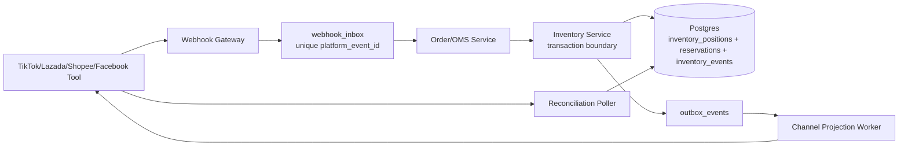
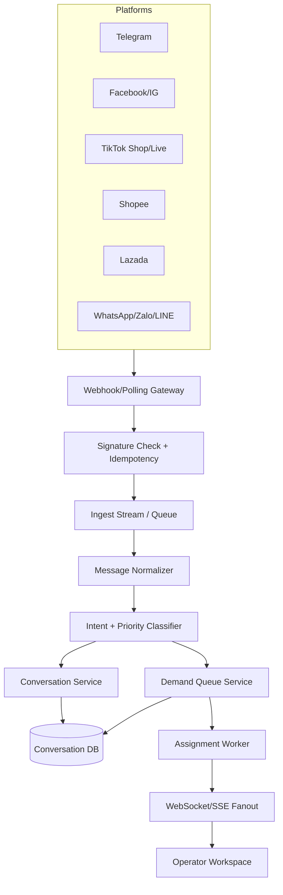
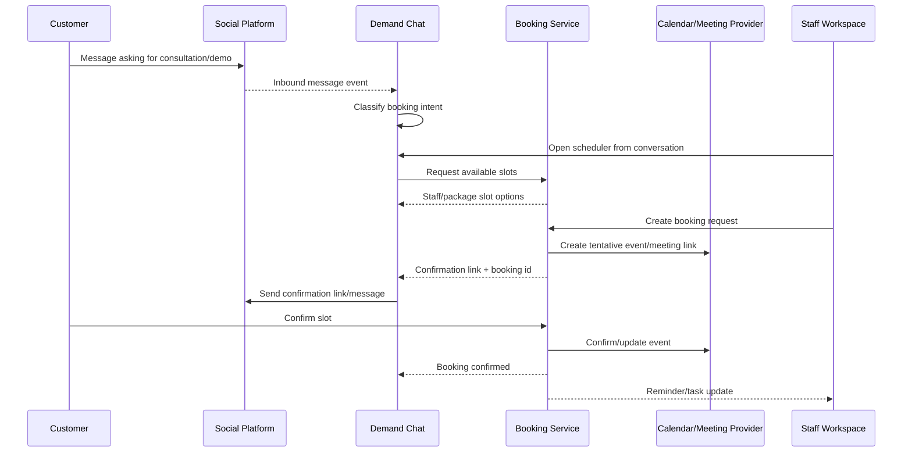

# Technical Design: Livestream Inventory, High-Throughput Demand, and Multi-Platform Service Booking

Date: 2026-06-12  
Scope: PrimeOS Phase 1 prototype to production-ready technical path for three requested areas:

1. Livestream inventory and anti-oversell.
2. High-volume multi-platform demand/chat handling and UX.
3. Service booking management across social platforms.

This document updates the older design notes against the current codebase. The current repo already contains several prototype pieces, but most of them are in-memory/demo-layer implementations. The remaining work is mostly about moving the same domain model into backend-owned services, adding persistence, queueing, idempotency, and production UX for operator overload.

---

## 0. Current State Summary

| Area | Already Present | Current Limit | Production Direction |
|---|---|---|---|
| Livestream inventory | `docs/deep-research-livestreamPrimeOS.md`, `apps/web/src/lib/inventory-store.ts`, `apps/web/src/lib/reservation-store.ts`, `ReservationLedger5State` UI | 5-state model exists in frontend memory; reservation ledger is not the backend source of truth; no channel projection or reconciliation service | Move inventory/reservation into backend Inventory Service with DB transactions, webhook inbox, SKU queue, and projection/reconciliation workers |
| Demand/chat | `apps/api/src/demand-chat.js`, `apps/api/src/telegram-gateway.js`, `/api/demand/*`, `PrimeDemandChatPage.tsx`, `PrimeDemandOperatorDashboard.tsx`, `demand-queue-store.ts` | Telegram-only live connector; backend scans connector messages on request; queue and operator dashboard are not fully connected to backend; no pagination/streaming/backpressure | Add Demand Ingest Service, event stream, conversation store, backend queue, WebSocket/SSE fanout, cursor pagination, and operator assignment |
| Service booking | `booking-store.ts`, `availability-engine.ts`, booking UI in Demand Chat, `/api/demand/bookings`, Growth OS hardcoded `serviceBookings` | Frontend in-memory booking model plus simple backend array; no transaction conflict prevention, calendar adapter, confirmation link, reminders, or platform-specific lifecycle | Add Booking Service owning packages/resources/availability/bookings with calendar/social adapters, status workflow, and source conversation linkage |

Important repo reality: there are many existing modified/untracked files. Treat the current implementation as a Phase 1 prototype baseline, not as final production runtime.

---

## 1. Livestream Inventory

### 1.1 What Has Been Handled

The deep research file already answers the business/architecture question well:

- One central inventory/OMS source of truth.
- `available_to_promise = on_hand - reserved_unpaid - reserved_paid - allocated - safety_stock - campaign_lock`.
- Webhook-first, polling-fallback channel integration.
- Reservation ledger with TTL, idempotency, and SKU-level queue/locking for hot SKUs.
- Facebook Live must be treated as comment/chat signal first; hard reservation should happen after checkout/confirmation, not from raw comment alone.

The code has started implementing this model:

- `apps/web/src/lib/inventory-store.ts` now has a 5-state `InventoryPosition` model: `reserved_unpaid`, `reserved_paid`, `allocated`, `return_pending`, `safety_stock`, `campaign_lock`, and `version`.
- `getTotalATP()` and `getATPBySkuWarehouse()` calculate ATP with the correct subtractors.
- `optimisticReserve()`, `confirmReservation()`, `releaseReservation()`, `allocateStock()`, and `deductStock()` exist as prototype operations.
- `apps/web/src/lib/reservation-store.ts` has TTL by source, idempotency key storage, state transitions, and `releaseExpiredReservations()`.
- `apps/web/src/pages/Inventory.tsx` exposes a Reservations tab using `ReservationLedger5State`.

So the answer to "livestream tính inventory làm sao?" is no longer only research. The domain model is already partially coded. The missing piece is that it is still demo-state, not a backend-enforced source of truth.

### 1.2 Required Production Source of Truth

Production PrimeOS should move inventory into a backend-owned Inventory Service. Frontend stores can remain for demo fallback only.



Inventory Service owns the only write path for:

- `inventory_positions`
- `inventory_reservations`
- `inventory_events_ledger`
- `inventory_idempotency_keys`
- `channel_inventory_projection`
- `channel_inventory_reconciliation_runs`

Frontend must not independently mutate inventory once this is productionized. It should call APIs and subscribe to updates.

### 1.3 State Model

Use this lifecycle for live commerce:

```text
sellable/on_hand
  -> RESERVED_UNPAID       order created, checkout opened, unpaid marketplace order
  -> RESERVED_PAID         paid/confirmed, not yet picked
  -> ALLOCATED             pick/pack started
  -> SHIPPED/DEDUCTED      on_hand deducted or outbound posted
  -> RETURN_PENDING        returned, waiting QC
  -> SELLABLE or DAMAGED   QC result
```

ATP formula:

```text
ATP = on_hand
    - reserved_unpaid
    - reserved_paid
    - allocated
    - safety_stock
    - campaign_lock
```

Channel reservation rules:

| Channel | When to Reserve | Reservation Strength | TTL | Notes |
|---|---|---|---|---|
| TikTok Shop | Order created / `UNPAID` webhook | Hard | 15-30m | Move to `RESERVED_PAID` after paid/ready-to-ship status |
| Lazada | Push/order state showing withhold/unpaid | Hard | Around platform policy | Map withhold to `RESERVED_UNPAID`, occupy/paid to `RESERVED_PAID` |
| Shopee | Unpaid/order-created if available, otherwise checkout/order pull | Soft to hard | 15-30m | Use polling fallback because public integration details vary |
| Facebook/Meta Live | Customer opens confirmation/checkout or verifies phone/OTP | Short hard hold | 5-15m | Raw comment creates lead/draft only, not hard reservation |
| Manual/operator | Operator explicitly creates hold | Hard | 10-30m | Must record actor and reason |

### 1.4 Concurrency Design

Use two modes based on SKU heat:

| SKU Type | Mode | Implementation |
|---|---|---|
| Normal SKU | Optimistic locking | Update with `WHERE version = expected_version`; retry 2-3 times |
| Hot livestream SKU | Serialized queue per `workspace_id + sku_id + warehouse_id` | BullMQ/Redis stream partition, or PostgreSQL advisory lock / `SELECT ... FOR UPDATE` |
| Bundle/combo | BOM reservation | Reserve each component SKU in the same transaction |
| Multi-warehouse | Node-specific ATP | Reserve only from warehouses allowed for the live/campaign fulfillment promise |

Minimum backend transaction for a reservation:

```text
BEGIN
  INSERT webhook_inbox/event if idempotency key is new
  SELECT inventory_position FOR UPDATE
  compute ATP
  if ATP < qty -> reject with OOS reason
  UPDATE inventory_position reserved_unpaid += qty, version += 1
  INSERT inventory_reservation state=RESERVED_UNPAID expires_at=...
  INSERT inventory_event ledger row
  INSERT outbox_event InventoryChanged
COMMIT
```

The in-memory `optimisticReserve()` is acceptable for prototype testing, but production must use DB-level transaction and row locking or serialized workers.

### 1.5 APIs To Add

Recommended backend API surface:

| Method | Path | Purpose |
|---|---|---|
| `GET` | `/api/inventory/positions?skuId=&warehouseId=` | Query positions and ATP |
| `POST` | `/api/inventory/reservations` | Create reservation from order/checkout/operator |
| `POST` | `/api/inventory/reservations/:id/confirm` | Move unpaid hold to paid hold |
| `POST` | `/api/inventory/reservations/:id/allocate` | Move paid hold to pick/pack allocation |
| `POST` | `/api/inventory/reservations/:id/release` | Release timeout/cancel holds |
| `GET` | `/api/inventory/reservations` | Ledger with cursor pagination |
| `POST` | `/api/webhooks/:platform/orders` | Platform order/status ingest |
| `POST` | `/api/inventory/reconcile/:platform` | Manual reconciliation trigger |

### 1.6 Production Gaps

P0 gaps before real live commerce:

- Move `inventory-store.ts` and `reservation-store.ts` semantics into backend and database.
- Make reservation creation update inventory position and reservation ledger in one transaction.
- Add idempotent webhook inbox for platform events.
- Add TTL release worker.
- Add OOS/reject flow and operator alert.

P1 gaps:

- Channel projection worker to push ATP back to Shopee/Lazada/TikTok/SaaS connector.
- Reconciliation worker to detect drift between PrimeOS and platform stock/order states.
- Hot SKU queue/locking switch.
- Bundle/BOM reservation.

P2 gaps:

- AI forecast/campaign throttling from demand spikes into `campaign_lock` and `safety_stock`.
- Live heatmap reporting: oversell prevented, timeout releases, checkout conversion by minute.

---

## 2. High-Throughput Demand and UX

### 2.1 What Has Been Handled

The repo already has early demand/chat surfaces:

- `apps/api/src/telegram-gateway.js` stores Telegram messages and can send outbound Telegram replies.
- `apps/api/src/demand-chat.js` aggregates connector messages into conversations and exposes simple in-memory demand queue and booking helpers.
- `apps/api/src/server.js` exposes `/api/demand/conversations`, `/api/demand/queue`, and `/api/demand/bookings` endpoints.
- `apps/web/src/pages/PrimeDemandChatPage.tsx` polls conversations every 3 seconds, shows platform badges, lets operators reply, and has a right-side booking scheduler.
- `apps/web/src/lib/demand-queue-store.ts` models P0/P1/P2 classification, SLA deadlines, assignment, snooze, and resolve.
- `apps/web/src/pages/PrimeDemandOperatorDashboard.tsx` renders queue tabs, KPI strip, SLA breach state, and claim/resolve/snooze actions.

This is enough to demonstrate the workflow. It is not enough to absorb many platforms and many simultaneous users.

### 2.2 Why Current Design Will Not Handle Heavy Demand

Current constraints:

- `/api/demand/conversations` recomputes conversations by scanning connector messages on request.
- Message storage is local/in-memory/file-backed, not a durable conversation database.
- Polling every 3 seconds works for a small demo but wastes load at scale and creates stale UX during spikes.
- Frontend conversation list has no cursor pagination or virtualization.
- Operator queue in `demand-queue-store.ts` is browser-local; it is not the same queue returned by backend `/api/demand/queue`.
- Only Telegram send is implemented. Other platform providers are placeholders from Growth OS connectors.
- No backpressure: when a platform floods inbound messages, PrimeOS has no rate-based ingest control, dead-letter queue, or platform quota guard.

### 2.3 Target Runtime Architecture



Use platform adapters at the edge, but normalize everything into one internal schema:

```ts
type NormalizedInboundMessage = {
  workspaceId: string;
  platform: 'telegram' | 'facebook' | 'instagram' | 'tiktok' | 'shopee' | 'lazada' | 'whatsapp' | 'zalo' | 'line';
  platformMessageId: string;
  platformConversationId: string;
  customerIdentityHints: { phoneHash?: string; emailHash?: string; platformUserId?: string; displayName?: string };
  direction: 'inbound' | 'outbound';
  text: string;
  attachments?: Array<{ type: string; url: string }>;
  receivedAt: string;
  rawRef: string;
};
```

Partition queue keys by:

```text
workspace_id + platform + platform_conversation_id
```

For live-order pressure, also produce priority jobs keyed by:

```text
workspace_id + live_session_id + sku_id
```

This lets PrimeOS preserve message order within a conversation while also serializing hot SKU/order workflows separately.

### 2.4 Demand Queue Semantics

Queue states:

```text
new -> unassigned -> assigned -> in_progress -> resolved
                      -> snoozed -> unassigned/assigned
                      -> escalated -> supervisor_queue
```

Priority rules:

| Priority | Meaning | First Response SLA | Routing |
|---|---|---|---|
| P0 | Live order, stock intent, checkout/payment issue during live | 30 seconds | Top of shared pool, eligible for auto-claim or live pod |
| P1 | Price/stock/product question, warm buying intent | 5 minutes | Skill or language-based routing |
| P2 | FAQ, support, generic message | 30 minutes | Normal shared queue or bot first response |

The existing `demand-queue-store.ts` already has most of this state model. Production should move it to backend and expose it through `/api/demand/queue` with cursor pagination and atomic claim/resolve operations.

Required backend operations:

| Method | Path | Purpose |
|---|---|---|
| `GET` | `/api/demand/queue?priority=&status=&cursor=` | Cursor-paginated queue list |
| `POST` | `/api/demand/queue/:id/claim` | Atomic claim by operator |
| `POST` | `/api/demand/queue/:id/resolve` | Resolve with disposition |
| `POST` | `/api/demand/queue/:id/snooze` | Snooze with wake-up timestamp |
| `POST` | `/api/demand/queue/:id/escalate` | Escalate to supervisor/specialist |
| `GET` | `/api/demand/conversations/:id/messages?cursor=` | Paginated messages |
| `POST` | `/api/demand/conversations/:id/send` | Outbound via selected connector |
| `GET` | `/api/demand/events/stream` | SSE/WebSocket updates for queue/message changes |

### 2.5 How PrimeOS Should Handle Too Many Messages

The UX answer is: do not make operators read one giant inbox. Convert the inbox into an operating queue.

Required UX behavior under load:

- Default view is not chronological inbox; default view is `P0 Live`, `My Queue`, and `Breached`.
- Shared inbox is filtered by priority, SLA, platform, campaign/live session, SKU, language, and assigned operator.
- Conversation list uses virtual scrolling and cursor pagination.
- Message thread loads newest messages first, with paginated history.
- Operators claim work atomically; two people cannot unknowingly answer the same customer.
- Duplicate customer identity is merged by phone/email hash/platform account when available.
- If one customer writes on multiple platforms, the context panel shows a unified customer timeline but outbound reply is tied to the active platform connector.
- P0 rows show timers and inventory context: mentioned SKU, current ATP bucket, reservation status, checkout link status.
- Quick actions sit beside the message: `Reply`, `Reserve`, `Send checkout link`, `Convert to booking`, `Create lead/RFQ`, `Escalate`.
- Bot/AI can draft or send low-risk first replies, but P0 reservation/payment/stock changes require explicit operator or policy approval.

Suggested overload modes:

| Load Condition | System Behavior | UX Behavior |
|---|---|---|
| Normal | Real-time push to all active operators | Standard chat + queue |
| Spike | Auto-prioritize P0/P1, batch P2, delay non-critical classification | Header shows live backlog and SLA risk |
| Severe spike | Backpressure platform polling, bot sends acknowledgement, route only P0 to humans | Queue narrows to P0/Breached; P2 hidden behind filter |
| Connector degraded | Stop sending through failing adapter, queue retry jobs | Platform badge turns degraded; operator sees safe fallback templates |

### 2.6 Capacity Model

Use these as design targets, not as claims about the current prototype:

| Tier | Inbound Volume | Required Infra | UX Requirement |
|---|---|---|---|
| Demo | <100 messages/hour | Current polling + in-memory is acceptable | Simple inbox |
| SME live | 1k-10k messages/hour | Queue, durable DB, cursor APIs, SSE/WebSocket | P0/P1/P2 lanes, atomic claim |
| Mid-market live | 10k-100k messages/hour | Horizontal gateway workers, Redis/Kafka/NATS, DB partitioning, cache | Virtualized queues, supervisor dashboard, SLA automation |
| Large campaign | 100k+/hour | Dedicated stream partitions by workspace/live/SKU, autoscaling workers, DLQ, replay | Live command room, bot triage, rate-aware connector health |

Minimum production components:

- Durable message store.
- Durable queue store.
- Webhook inbox with idempotency.
- Worker retries with exponential backoff and DLQ.
- SSE/WebSocket fanout instead of 3-second full polling.
- Metrics: ingest lag, queue depth, SLA breach, send failure rate, connector rate limit, operator throughput.

---

## 3. Service Booking Across Social Platforms

### 3.1 What Has Been Handled

Current code already has the start of a service booking experience:

- `apps/web/src/lib/booking-store.ts` defines `ServicePackage`, `StaffResource`, and `Booking` with source conversation linkage.
- `apps/web/src/lib/availability-engine.ts` computes staff slots from work hours, existing bookings, package duration, and concurrent limit.
- `PrimeDemandChatPage.tsx` has booking state and can create a booking from the selected conversation.
- `apps/api/src/demand-chat.js` has simple in-memory `createBooking()` / `getBookings()`.
- `apps/api/src/server.js` exposes `/api/demand/bookings`.
- Growth OS has hardcoded `serviceBookings` for dashboard storytelling.

This is a good product skeleton. It is not yet a real booking service.

### 3.2 Target Booking Service Boundary

Create a backend Booking Service with these responsibilities:

- Service package catalog.
- Staff/resource calendar and skill metadata.
- Availability calculation and conflict prevention.
- Booking lifecycle state machine.
- Link booking to demand conversation, customer profile, lead/RFQ, and service ticket.
- Generate confirmation link and platform-specific outbound message.
- Calendar/meeting adapter integration.
- Reminder and no-show workflow.
- Audit trail for changes.

Booking Service should own:

```text
service_packages
service_resources
resource_work_hours
bookings
booking_events
booking_confirmations
calendar_connections
booking_reminders
```

### 3.3 Booking Lifecycle

```text
requested
  -> pending_customer_confirm
  -> confirmed
  -> rescheduled
  -> completed
  -> no_show
  -> cancelled
```

Recommended transition rules:

| Transition | Trigger | Guardrail |
|---|---|---|
| `requested -> pending_customer_confirm` | Operator creates slot from chat | Slot must still be available in transaction |
| `pending_customer_confirm -> confirmed` | Customer clicks link/replies yes/calendar accept | Confirmation token or platform event must be idempotent |
| `confirmed -> rescheduled` | Operator/customer chooses new slot | Old slot release and new slot hold happen in one transaction |
| `confirmed -> completed` | Staff marks done or meeting provider webhook | Requires start time passed or explicit override |
| `confirmed -> no_show` | No customer join/check-in | Configurable grace period |
| `* -> cancelled` | Customer/operator cancel | Record reason, actor, source platform |

### 3.4 Multi-Platform Booking Flow



Platform-specific outbound behavior:

| Platform | Confirmation Path | Notes |
|---|---|---|
| Telegram/WhatsApp/Zalo/LINE | Send booking link in chat | Reuse `sendConversationMessage()` through connector adapter |
| Facebook/Instagram | DM confirmation link; comment is only a signal | Keep customer PII on PrimeOS confirmation page |
| TikTok Live | DM or checkout/landing link after live intent | Do not rely on comment as final consent |
| Website | Direct confirmation page | Best path for auth/capture, terms, and data consent |
| Zoom/Google Meet | Calendar invite + provider link | Created by calendar adapter after booking hold/confirm |

### 3.5 Availability and Conflict Prevention

The existing `availability-engine.ts` is enough for UI preview, but production booking must reserve slots transactionally.

Minimum backend transaction:

```text
BEGIN
  SELECT resource availability row FOR UPDATE
  check working hours
  count overlapping active bookings
  if count >= max_concurrent_bookings -> reject
  INSERT booking status=pending_customer_confirm
  INSERT booking_event booking_requested
  INSERT outbox_event BookingConfirmationRequested
COMMIT
```

Do not trust a slot shown in the UI until the backend confirms it. Between render and click, another operator/customer may take the same slot.

### 3.6 APIs To Add

| Method | Path | Purpose |
|---|---|---|
| `GET` | `/api/service/packages` | List bookable packages |
| `GET` | `/api/service/resources` | List staff/resources and skills |
| `GET` | `/api/service/availability?packageId=&resourceId=&date=` | Slot search |
| `POST` | `/api/service/bookings` | Create booking request from chat/lead/customer |
| `GET` | `/api/service/bookings?status=&resourceId=&customerId=&cursor=` | Booking queue/calendar |
| `POST` | `/api/service/bookings/:id/confirm` | Confirm customer-selected booking |
| `POST` | `/api/service/bookings/:id/reschedule` | Move slot |
| `POST` | `/api/service/bookings/:id/cancel` | Cancel with reason |
| `POST` | `/api/service/bookings/:id/complete` | Mark complete |
| `POST` | `/api/webhooks/calendar/:provider` | Calendar provider webhook |

### 3.7 UX for Multi-Platform Booking

In `PrimeDemandChatPage`, the booking sidebar should evolve into a service command panel:

- Show customer identity, source platform, language, and linked profile.
- Show booking intent detected from conversation.
- Select package, staff, date, and slot.
- Slot grid should distinguish: available, full, tentative, unavailable, outside working hours.
- After booking is created, show a confirmation artifact: link, status, expiry, provider, staff owner.
- Provide one-click outbound templates per platform: confirmation, reschedule, reminder, cancellation.
- Show active bookings and previous no-shows for the same customer.
- Escalate to service ticket if booking requires prep, complaint handling, or post-call follow-up.

Service dashboard should aggregate:

- Today/tomorrow/week capacity by staff.
- Requested vs confirmed vs completed vs no-show.
- Booking source by platform.
- Revenue/value by package.
- SLA: time from booking intent to confirmed slot.

---

## 4. Cross-Service Contracts

These three areas should not be separate silos. The important product value is the handoff between them.

| Event | Producer | Consumer | Result |
|---|---|---|---|
| `MessageReceived` | Demand Ingest | Demand Queue, CRM | Queue item and customer timeline update |
| `OrderIntentDetected` | Demand Classifier | Inventory, Checkout | Show SKU ATP and checkout/reservation action |
| `ReservationCreated` | Inventory Service | Demand UI, OMS | Chat shows hold timer and remaining ATP |
| `ReservationExpired` | Inventory Service | Demand UI, Channel Projection | Operator sees lost hold; ATP is projected back out |
| `BookingRequested` | Booking Service | Demand UI, Calendar Adapter | Confirmation link sent through active platform |
| `BookingConfirmed` | Booking Service | Customer Service, Growth OS | Customer lifecycle moves to booked/confirmed |
| `ServiceCompleted` | Booking Service | CRM, Finance/Growth OS | Follow-up task and revenue attribution |

Recommended event envelope:

```ts
type PrimeDomainEvent = {
  id: string;
  workspaceId: string;
  type: string;
  aggregateType: 'conversation' | 'demand_item' | 'reservation' | 'booking' | 'order' | 'customer';
  aggregateId: string;
  occurredAt: string;
  idempotencyKey: string;
  payload: Record<string, unknown>;
};
```

---

## 5. Implementation Plan

### P0: Make the Prototype Technically Honest

1. Update product docs and route labels to state that current inventory/queue/booking implementations are in-memory prototype layers.
2. Connect `PrimeDemandOperatorDashboard` to backend `/api/demand/queue` instead of local `demand-queue-store.ts` only.
3. Add backend endpoint parity for claim/resolve/snooze.
4. Make booking creation in `PrimeDemandChatPage` call backend `/api/demand/bookings` or new `/api/service/bookings` instead of frontend-only store.
5. Add tests for inventory ATP math, reservation idempotency, queue priority classification, and availability overlap.

### P1: Production Foundation

1. Add database tables for inventory positions, reservations, demand messages, demand queue, service packages/resources/bookings, and webhook inbox.
2. Move reservation transitions into backend transactions.
3. Add demand ingest worker with idempotency and normalized message schema.
4. Add cursor pagination and SSE/WebSocket updates for Demand Chat.
5. Add atomic operator claim for queue items.
6. Add transactional booking availability check.

### P2: Multi-Platform Runtime

1. Add platform adapters beyond Telegram: Facebook/Instagram, WhatsApp/Zalo/LINE, TikTok/Shopee/Lazada order/event connectors.
2. Add channel inventory projection and reconciliation workers.
3. Add calendar adapters: Google Calendar/Meet and Zoom.
4. Add platform-aware confirmation/reminder templates.
5. Add supervisor dashboard for backlog, SLA breach, connector health, and staff capacity.

### P3: Scale and Automation

1. Add hot SKU serialized queue.
2. Add autoscaling worker metrics and DLQ replay tools.
3. Add AI-assisted intent classification, reply drafts, duplicate buyer detection, and live campaign throttling.
4. Add audit-grade event timeline across chat, reservation, order, booking, and service completion.

---

## 6. Final Technical Answer

For livestream inventory, PrimeOS should use a backend Inventory Service with 5-state reservations and ATP, not a single stock number. The current repo already models this in the frontend prototype, but production requires DB transactions, idempotency, TTL release, hot SKU queueing, projection, and reconciliation.

For demand spikes, PrimeOS should not scale by making a bigger chat inbox. It should ingest all platforms through gateways into a durable stream, normalize messages, classify priority, place them into backend queues, and push real-time updates to a virtualized operator workspace. UX should force P0/P1/SLA triage instead of chronological reading.

For service booking, PrimeOS should turn the current booking sidebar into a real Booking Service: package/resource catalog, transactional availability, source conversation linkage, platform confirmation link, calendar/meeting adapter, reminders, and lifecycle events into Customer Service/Growth OS.

