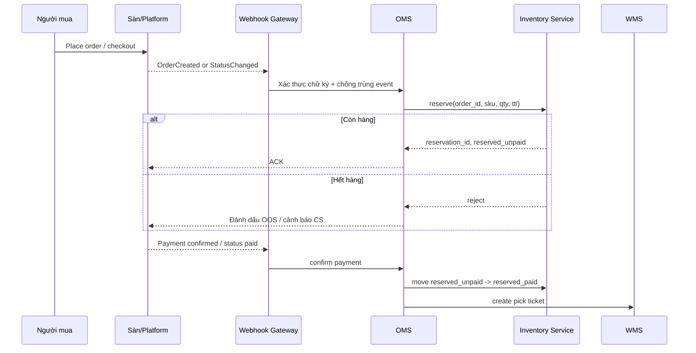
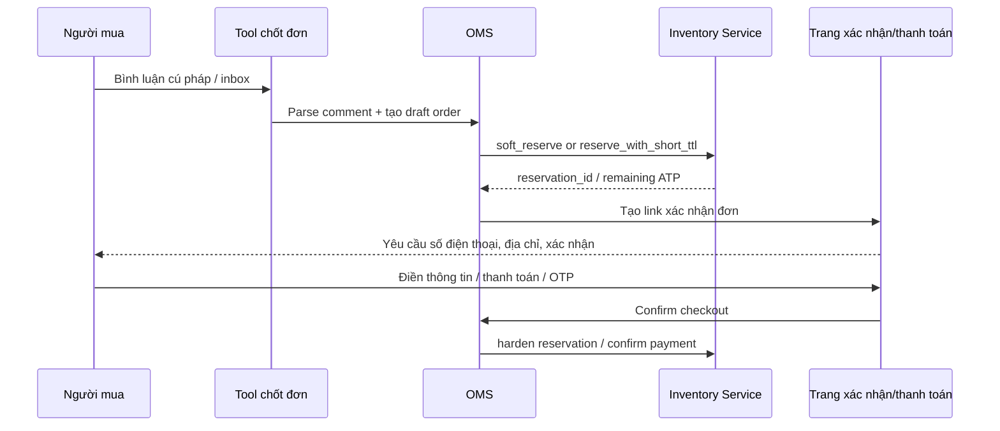
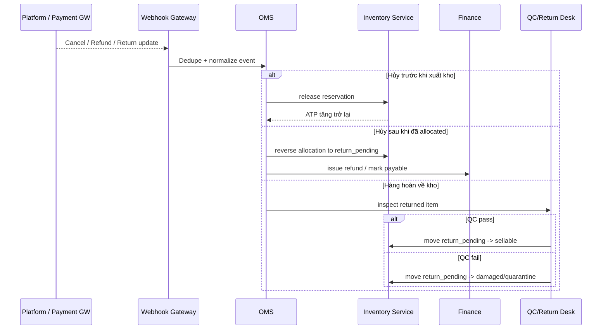
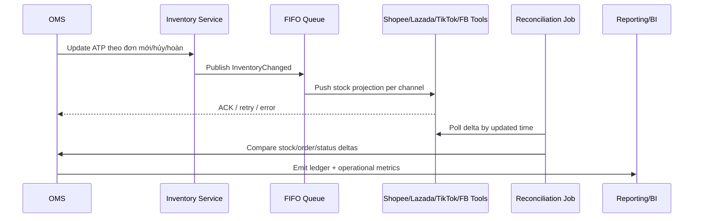

# Báo cáo chuyên sâu về tính tồn kho và quản trị kho cho đơn chốt trong livestream tại Việt Nam

## Tóm tắt điều hành

Trong bối cảnh Việt Nam, bài toán “khách chốt đơn trong livestream nhưng kho không bị âm và không bán trùng” không nên được giải bằng một con số tồn duy nhất hiển thị trên mọi kênh. Cách làm bền vững hơn là tách tồn kho thành các trạng thái nghiệp vụ: **có thể bán**, **đã giữ chỗ chưa thanh toán**, **đã thanh toán chờ xử lý**, **đang nhặt/đóng gói**, **đang giao**, **hàng hoàn chờ kiểm**. Cách chia này phù hợp với chính logic của các sàn lớn: Lazada có `withholdQuantity` cho đơn chưa thanh toán và `occupyQuantity` cho đơn đã thanh toán; TikTok Shop tạo order ngay khi người mua bấm Place Order và đẩy trạng thái `UNPAID`, sau đó có thể chuyển sang `ON_HOLD`/`AWAITING_SHIPMENT`; Shopee Open Platform cũng vận hành theo chuỗi trạng thái đơn để đồng bộ với hệ thống bên ngoài. citeturn42search0turn44search1turn44search0turn46search0turn46search3turn45search0

Khuyến nghị cốt lõi của báo cáo này là: **đặt một OMS hoặc dịch vụ tồn kho trung tâm làm nguồn sự thật duy nhất**, sau đó chiếu tồn kho ra các kênh bằng mô hình **webhook-first, polling-fallback**, kết hợp **reservation ledger**, **idempotency**, **queue theo SKU hoặc theo shop+SKU**, và **buffer stock theo quy tắc SKU**. Strong consistency chỉ nên áp dụng trong biên giới giao dịch nội bộ của hệ thống tồn kho; còn giữa OMS với Shopee, Lazada, TikTok Shop, Facebook/Meta thì thực tế phải chấp nhận eventual consistency do bản chất push notification, retry, rate limit và chu kỳ đồng bộ của nền tảng. citeturn43search9turn44search3turn39search9turn35search1turn35search2

Về mặt kênh bán, **TikTok Shop VN** và **Lazada** là hai nền tảng dễ thiết kế anti-oversell nhất vì tài liệu chính thức mô tả khá rõ thời điểm tạo đơn, tồn giữ chỗ và webhook trạng thái. **Shopee** hỗ trợ đồng bộ sản phẩm, giá, tồn và trạng thái đơn qua Open Platform, nhưng tài liệu public indexable hiện kém thân thiện hơn; vì vậy thực hành triển khai thường phải dựa vào Open Platform portal kết hợp tài liệu của các đối tác tích hợp đã tiêu thụ API này. **Facebook/Meta Live** trong thực tế Việt Nam lại chủ yếu vận hành theo mô hình “bình luận/chat → tool chốt đơn → trang xác nhận/checkout”, tức là đơn hàng nằm ngoài Facebook và việc chống oversell phụ thuộc rất lớn vào phần mềm trung gian như Sapo, Haravan, Vpage/Nhanh hay Pancake. citeturn44search1turn42search0turn36search1turn46search3turn25search5turn14search0turn16search3turn17search0

Nếu ngân sách và quy mô chưa xác định, nên chia quyết định theo ba mức. Với **quy mô thấp**, dùng SaaS omnichannel tại Việt Nam có sẵn chốt đơn livestream và đồng bộ sàn là hợp lý. Với **quy mô trung bình**, nên bổ sung middleware, hàng đợi và một reservation ledger tách khỏi SaaS. Với **quy mô cao**, nên xây một inventory service độc lập, event-driven, có outbox, FIFO hoặc partition theo SKU, và cơ chế reconciliation tự động nhiều lớp. citeturn15search0turn14search0turn16search0turn40search3turn21search1turn19search1turn22search0turn35search1turn35search2

### PrimeOS implementation mapping

Tính tới ngày 2026-06-12, PrimeOS đã bắt đầu map khuyến nghị trong báo cáo này vào prototype: `apps/web/src/lib/inventory-store.ts` có mô hình tồn 5-state và công thức ATP; `apps/web/src/lib/reservation-store.ts` có reservation ledger TTL/idempotency; Demand Chat và Operator Dashboard đã có khung inbox/queue; booking từ hội thoại đã có store và availability engine demo. Phần còn thiếu là chuyển các store in-memory này thành backend service có database transaction, webhook inbox, queue worker, channel projection/reconciliation và API phân trang/real-time. Bản thiết kế kỹ thuật cụ thể nằm ở `docs/12-technical-design-livestream-demand-service.md`.

Bảng dưới đây là khuyến nghị nhanh theo quy mô giả định:

| Quy mô giả định | Kiến trúc nên chọn | Công cụ phù hợp | Mục tiêu chính |
|---|---|---|---|
| Thấp | SaaS-centric, webhook nếu có, polling dự phòng 1–3 phút | Sapo, Haravan, Nhanh/Vpage, KiotViet | Đi nhanh, giảm sót đơn, chặn oversell bằng buffer + xác nhận khách |
| Trung bình | OMS trung tâm + reservation ledger + queue + webhooks | SaaS Việt Nam + middleware riêng, hoặc Odoo | Tách logic đơn/tồn khỏi từng kênh, chịu được peak live |
| Cao | Inventory service riêng + event bus/outbox + WMS/ERP | Odoo Custom, Dynamics 365 BC, SAP B1, WMS riêng | Tính đúng tồn theo SKU/multi-warehouse ở tải cao |

Các lựa chọn SaaS và ERP ở bảng trên được suy ra từ năng lực tích hợp, API, webhooks, quản lý đơn/kho và mô hình giá công khai của từng nhà cung cấp. citeturn15search0turn14search0turn16search0turn40search3turn21search1turn19search1turn22search0

## Bối cảnh Việt Nam và nguyên tắc thiết kế nguồn tồn kho

Trong livesteam commerce tại Việt Nam, bốn nhóm nền tảng cần được xử lý khác nhau. Shopee Live, Lazada Live và TikTok Shop là các nền tảng **native transaction**: người mua đặt hoặc xác nhận mua ngay trên nền tảng, nên hệ thống của người bán cần nghe trạng thái đơn và đẩy tồn kho ngược ra sàn hoặc về OMS. Facebook/Meta Live ở Việt Nam thường là **lead/comment-first**: khách để lại bình luận hoặc chat, sau đó phần mềm ngoài nền tảng mới tạo đơn, thu địa chỉ và gửi link xác nhận/thanh toán. Chính sự khác biệt này quyết định thời điểm “giữ hàng” và mức buffer nên dùng. citeturn42search0turn44search1turn45search0turn25search5turn14search0turn16search3

Nguyên tắc quan trọng nhất là **không lấy tồn ở từng kênh làm nguồn sự thật**. Lazada mô tả rõ rằng sellable, withhold, occupy và total quantity là các lớp tồn khác nhau; KiotViet công khai cả `onhand` và `reserved` trong Public API; Nhanh.vn tự tính “Tạm giữ” khi tạo đơn API có gắn kho. Điều này cho thấy cách quản trị đúng không phải là “trừ stock một lần khi có đơn thành công”, mà là quản lý một sổ cái tồn kho có trạng thái. citeturn42search0turn42search3turn40search3turn39search6

Một mô hình nguồn sự thật thực tế cho Việt Nam là:

`available_to_promise = on_hand - reserved_unpaid - reserved_paid - picking - safety_stock - campaign_lock`

Đây không phải công thức pháp lý bắt buộc, mà là công thức vận hành nên có trong OMS/inventory service để luôn biết “thực sự còn bao nhiêu để bán ngay trong live”. Nó tương thích với các khái niệm `withholdQuantity`, `occupyQuantity`, `sellableQuantity` của Lazada và với các trường reserved hoặc tạm giữ ở phần mềm bán hàng Việt Nam. citeturn42search0turn42search1turn40search3turn39search6

Bảng sau tóm tắt đặc tính của từng kênh ưu tiên trong bối cảnh Việt Nam:

| Nền tảng | Dấu hiệu kỹ thuật đáng chú ý | Cách ingest nên dùng | Quy tắc tồn kho nên ưu tiên | Nguồn chính |
|---|---|---|---|---|
| TikTok Shop VN | Order được tạo khi buyer bấm Place Order; status có `UNPAID`, `ON_HOLD`, `AWAITING_SHIPMENT`; có warehouse list, order status webhook, inventory status webhook | Webhook trạng thái đơn + webhook tồn kho; polling backfill | Giữ chỗ ngay khi `UNPAID`; không xuất kho khi `ON_HOLD`; chỉ chuyển sang fulfillment khi `AWAITING_SHIPMENT` | citeturn44search1turn44search0turn44search2turn32search0turn32search3turn32search5 |
| Lazada Live | Có `withholdQuantity`, `occupyQuantity`, multicwarehouse inventories; push mechanism cho order/status | Lazada Push là chính; GetOrders/GetOrderItems để backfill | Map trực tiếp `withhold` = reserved_unpaid, `occupy` = reserved_paid; release nếu unpaid quá 30 phút | citeturn42search0turn42search1turn43search9turn43search0turn43search2turn43search7 |
| Shopee Live | Open Platform hỗ trợ orders/products/inventory; partner docs cho thấy dùng `update_stock` và status push | Webhook/pull scheduler theo Open Platform hoặc middleware của đối tác | Nếu có thể đọc đơn `UNPAID` thì giữ chỗ mềm; confirm mạnh khi `READY_TO_SHIP`; cập nhật stock bằng API hoặc qua middleware | citeturn36search1turn46search3turn46search0turn45search0 |
| Facebook/Meta Live | Bình luận có thể bị moderation/hạn chế; tại VN, tool thường auto tạo đơn theo cú pháp comment/chat và gửi trang xác nhận/thanh toán | Parser comment/chat trong tool; webhook nội bộ từ tool sang OMS | Không giữ hàng chỉ vì thấy comment; chỉ giữ khi tool tạo draft order hoặc khách mở checkout/OTP xác nhận | citeturn9search3turn25search0turn25search5turn14search0turn16search3turn17search0 |

Hệ quả vận hành là: nếu bạn bán nặng trên Facebook Live, anti-oversell sẽ đến từ **UI/UX xác nhận đơn + reservation nội bộ**, chứ không đến từ Facebook. Nếu bạn bán nặng trên TikTok Shop hoặc Lazada, anti-oversell lại đến từ **đọc đúng trạng thái order + phản ánh đúng reservation state**. Với Shopee, nên xem middleware hoặc đối tác tích hợp như một cách giảm rủi ro tài liệu và sandbox. citeturn25search5turn42search0turn44search1turn46search0

## Chiến lược tồn kho thời gian thực cho livestream

### Mô hình giữ chỗ và thời điểm trừ tồn

Với live commerce, cách an toàn nhất là chuyển từ tư duy “trừ kho khi đơn hoàn tất” sang tư duy “**giữ chỗ theo sự kiện**”. Trên Lazada, nền tảng đã phân biệt sẵn đơn chưa thanh toán với `withholdQuantity` và đơn đã thanh toán với `occupyQuantity`. Trên TikTok Shop, tài liệu chính thức nói rõ order được tạo ngay khi buyer bấm Place Order và seller nên deduct hoặc hold inventory từ lúc đó. Điều này cho thấy chiến lược phù hợp là: **reserve sớm, commit muộn**. citeturn42search0turn44search1

Trong thực tế, bốn moment quan trọng cần được định nghĩa cho từng SKU và từng kênh:

| Moment | Hành động khuyến nghị | Dùng cho kênh nào |
|---|---|---|
| Khách comment cú pháp / add to cart | Có thể tạo lead hoặc draft reservation mềm, nhưng chưa nên giữ hard stock nếu chưa có xác thực khách | Facebook/Meta Live, social chat |
| Khách mở checkout / order tạo trạng thái `UNPAID` | Giữ chỗ cứng có TTL | TikTok Shop, Lazada, Shopee nếu có thể ingest trạng thái sớm; Facebook nếu đã sang trang xác nhận |
| Khách thanh toán / order paid / `ON_HOLD` / `READY_TO_SHIP` | Chuyển từ `reserved_unpaid` sang `reserved_paid`, không trả lại ATP | TikTok Shop, Lazada, Shopee |
| Hết hạn / cancel / payment fail | Release reservation và re-publish ATP | Tất cả |

Phần “TTL” là cực kỳ quan trọng. Lazada công khai thời gian release hàng chưa thanh toán sau 30 phút. Với Facebook Live hoặc website riêng, TTL nên do bạn tự quản trị, thường 5–15 phút cho live nóng và 15–30 phút cho live bình thường. TTL càng ngắn thì anti-oversell càng mạnh, nhưng UX càng dễ gây bực vì khách mất giỏ. citeturn42search0

### Optimistic locking và pessimistic locking

**Optimistic locking** phù hợp khi SKU không quá nóng và bạn muốn throughput cao: mỗi bản ghi tồn kho có `version`, mọi update chỉ thành công nếu `version` hiện tại khớp với phiên bản vừa đọc. Khi có tranh chấp, request thất bại và retry. Cách này hợp với TikTok/Lazada/Shopee khi số cạnh tranh trên cùng một SKU chưa quá cực đoan, hoặc khi bạn đã có buffer stock che bớt spike. Đây cũng là cách dễ scale hơn trong môi trường microservice vì ít lock database dài. Phần khuyến nghị này là phân tích kiến trúc, không phải quy tắc bắt buộc của riêng một nền tảng. citeturn42search0turn44search1turn35search1

**Pessimistic locking** nên dùng cho “hot SKU” trong live, limited drops, combo quà tặng khan hàng, hoặc các sản phẩm có thể tạo ra một đợt tranh mua trong vài giây. Ở tầng SQL, đây là `SELECT ... FOR UPDATE`; ở tầng hệ thống phân tán, đây có thể là serial queue theo `shop_id + sku_id`. Đổi lại, throughput sẽ thấp hơn nhưng đổi được tính đúng cao hơn. Nếu live của bạn có hiện tượng hàng chỉ còn vài chục chiếc nhưng comment lên hàng trăm mỗi phút, pessimistic lock hoặc FIFO queue theo SKU thường đáng giá hơn optimistic retry. citeturn35search2turn35search0

### Pre-authorization, buffer stock và rule engine theo SKU

**Payment pre-authorization** rất hữu ích khi bạn có checkout riêng trên website/app: thanh toán được authorise trước, capture sau khi xác nhận còn hàng hoặc sau khi đóng gói. Stripe và PayPal đều mô tả rõ mô hình authorize-then-capture và việc hold có thời hạn; nếu quá hạn không capture thì hold sẽ bị release. Cách này mạnh về chống “đơn ảo” nhưng chỉ phù hợp khi bạn kiểm soát checkout và có phương thức thanh toán hỗ trợ auth/capture; nó ít phù hợp hơn với luồng COD hoặc chuyển khoản thủ công vốn phổ biến ở SME Việt Nam. citeturn26search1turn26search3turn26search9

**Buffer stock** là lớp đệm bắt buộc nếu bạn bán đa kênh hoặc vẫn có thao tác tay trong vận hành. Báo cáo này khuyến nghị buffer không cố định cho toàn bộ catalog, mà theo rule engine:

| Loại SKU | Rule nên dùng |
|---|---|
| SKU nóng trong live, limited, collab | Pessimistic lock hoặc queue theo SKU; buffer 5–10% hoặc tối thiểu cố định |
| SKU phổ thông, tồn dày | Optimistic lock; buffer 1–3% |
| Bundle/combo | Reserve theo BOM thành phần, không chỉ reserve theo mã bundle |
| Pre-order / made-to-order | Không hard reserve on-hand; quản trị bằng quota pre-order + SLA |
| Multi-warehouse | Chỉ ATP từ warehouse được phép fulfill live; tránh bán rồi buộc split shipment rủi ro cao |

Buffer stock không có một tỷ lệ “đúng” cho mọi ngành; nhưng việc áp dụng theo SKU cấp biến thể là khả thi vì Lazada, TikTok, Odoo, KiotViet và Nhanh đều làm việc ở cấp SKU/warehouse hoặc item variant, không phải chỉ ở cấp sản phẩm tổng. citeturn42search0turn32search0turn20search2turn40search3turn39search6

## Kiến trúc tích hợp và lựa chọn đồng bộ

### Webhooks, polling, middleware và queue

Với livestream commerce, **webhook phải là đường chính**, còn polling là **đường cứu hộ**. Lazada Push nói thẳng rằng polling order hàng nghìn lần mỗi giờ vẫn không ra được dữ liệu mới nhất và còn dễ bị throttled; TikTok Shop định nghĩa webhook là cơ chế real-time để nhận order status, return status và các thay đổi khác; Nhanh.vn cung cấp cả webhook lẫn API list với `updatedAtFrom/To`, rất phù hợp cho backfill và reconciliation. citeturn43search9turn44search3turn39search1turn39search9

Cấu trúc tích hợp nên là:

`Platform/Webhook -> Webhook Gateway -> Idempotency/Dedup -> OMS -> Inventory Service -> Queue -> WMS/ERP -> Channel Projection`

Trong đó, **Webhook Gateway** chỉ làm ba việc: xác thực chữ ký hoặc nguồn gửi, chuẩn hoá payload, và chống trùng event. Không nên viết business logic trực tiếp ở gateway. OMS nhận event rồi phát command sang inventory service. Nếu command vừa cập nhật DB vừa phải publish message, nên dùng **transactional outbox** để không rơi vào tình huống “DB đã commit nhưng event chưa gửi” hoặc ngược lại. citeturn35search1

Khi cần giữ đúng thứ tự theo SKU hoặc theo đơn, có thể dùng hàng đợi kiểu FIFO. Tài liệu AWS SQS FIFO nhấn mạnh hai lợi ích: bảo toàn thứ tự và tránh duplicate do queue tạo ra; vẫn vậy, consumer phải idempotent vì retry ở tầng ứng dụng hoặc crash giữa chừng vẫn có thể khiến cùng nghiệp vụ bị chạy lại. citeturn35search2turn35search0turn35search1

### Strong consistency và eventual consistency nên chia ở đâu

Không thực tế để kỳ vọng **strong consistency xuyên kênh** giữa OMS, Lazada, TikTok Shop, Shopee, Facebook và WMS vì mỗi bên có cơ chế event, SLA, retry và rate limit riêng. Thiết kế tốt là:

- **Strong consistency nội bộ**: reservation/create order/update ATP trong cùng transaction DB hoặc inventory service.
- **Eventual consistency liên hệ thống**: chiếu tồn kho ra sàn, nhận status đẩy về, backfill bằng polling.
- **Compensating actions**: nếu projection fail, giữ record pending sync và retry; nếu hết retry thì cảnh báo operator. citeturn43search9turn44search3turn35search1

Nói ngắn gọn: **đừng “phân tán” bài toán đúng-sai của tồn kho ra mọi nền tảng**. Hãy chỉ để một nơi chịu trách nhiệm tính ATP, còn các nền tảng chỉ là consumers/producers của event tồn và event đơn.

### Kiến trúc khuyến nghị theo quy mô

| Quy mô | Kiến trúc đề xuất | Latency mục tiêu | Điểm mạnh | Điểm yếu | Nguồn gợi ý |
|---|---|---|---|---|---|
| Thấp | Sapo/Haravan/Nhanh/KiotViet làm OMS-lite; webhook nền tảng nếu có; cron polling 1–3 phút | 5–60 giây | Nhanh triển khai, ít code | Khó kiểm soát hot SKU, phụ thuộc SaaS | citeturn25search1turn14search0turn16search0turn40search3 |
| Trung bình | OMS riêng hoặc hub tích hợp; reservation ledger; webhook-first; polling cursor fallback; queue theo shop/SKU | dưới 5 giây nội bộ, dưới 1 phút xuyên kênh | Chịu peak live tốt hơn, audit rõ | Cần devops, monitoring, idempotency | citeturn39search9turn43search9turn44search3turn35search1turn35search2 |
| Cao | Inventory service riêng; event bus/outbox; FIFO hoặc partition theo SKU; WMS/ERP tích hợp chặt; reconciliation nhiều lớp | dưới 1 giây nội bộ, dưới 10–30 giây projection | Chịu tải cao, multi-warehouse, recovery mạnh | Chi phí build và vận hành cao | citeturn35search1turn35search2turn19search1turn22search0 |

## Bản đồ nền tảng và hệ sinh thái phần mềm

### So sánh phần mềm phù hợp cho đơn livestream và tồn kho đa kênh

| Giải pháp | Loại | Tính năng liên quan trực tiếp đến livestream và tồn kho | Mô hình giá hiện thấy | Độ phức tạp tích hợp | Phù hợp nhất | Nguồn chính |
|---|---|---|---|---|---|---|
| **Sapo Omni / OmniAI** | OMS/omnichannel Việt Nam | Quản lý Facebook livestream, kịch bản chốt đơn, trang thanh toán chốt đơn, đồng bộ sàn Shopee/TikTok Shop/Lazada/Tiki, private apps/API | Start Up 170k/tháng, Pro 249k, Omni 600k/tháng | Thấp đến trung bình | SME, social-first, đa sàn vừa phải | citeturn15search0turn25search0turn25search3turn25search5turn37search9 |
| **Haravan / Harasocial** | OMS/omnichannel Việt Nam | Tạo đơn tự động từ comment livestream, auto kiểm tra/cập nhật tồn, ẩn comment, gửi xác nhận, live nhiều fanpage, Open API | Standard 300k/tháng; Omni Advanced 800k/tháng; add-on livestream 300k/tháng | Thấp đến trung bình | SME đến mid-market, Facebook livestream nặng | citeturn14search0turn14search1turn38search0turn38search2 |
| **Nhanh.vn + Vpage** | OMS + social commerce | Chốt đơn livestream Facebook, quản lý comment/tin nhắn, đồng bộ Shopee/TikTok/Lazada/Tiki/Sendo, Open API v3, webhooks order, tài chính sàn | Vpage 100k/page/tháng; Ecom 100k/gian hàng/tháng; Website 200k/tháng | Thấp đến trung bình | SME, operator-heavy, cần API/webhook rõ | citeturn16search0turn16search1turn16search3turn39search0turn39search1turn39search6 |
| **KiotViet** | POS/OMS Việt Nam | Đồng bộ sàn, liên kết Facebook, Public API đọc/ghi sản phẩm/đặt hàng/hóa đơn; có `reserved` theo chi nhánh trong API | Giá từ 11.000đ/ngày; Public API áp dụng cho gói cao cấp | Thấp đến trung bình | Cửa hàng/chuỗi nhỏ–vừa cần POS + kho + online | citeturn24search0turn24search1turn40search0turn40search3turn40search4 |
| **Pancake** | Social commerce / business messaging | Gom hội thoại đa nền tảng, auto order capture từ livestream/chat, order creation, plan theo số connection/user, có docs developer | Tier-based Small/Standard/Business/Custom; giá crawl công khai chưa ổn định nên nên coi là demo/quote | Trung bình | Team social lớn, volume hội thoại cao | citeturn17search0turn18view0turn17search2 |
| **Odoo** | ERP/WMS/OMS | Inventory app, reservation methods at confirmation/manual/before scheduled date, multi-company, external API ở gói Custom | One App Free; Standard 24.90 USD/user/tháng; Custom 49 USD/user/tháng | Trung bình đến cao | Mid-market muốn tự chủ quy trình | citeturn20search2turn21search1 |
| **Dynamics 365 Business Central** | ERP | Warehouse management, supply chain planning, multiple companies, finance + operations | Essentials 80 USD/user/tháng; Premium 110 USD/user/tháng | Cao | Seller lớn, vận hành nhiều bộ phận | citeturn19search1 |
| **SAP Business One** | ERP | Purchasing & inventory control, warehouse/accounting integration, sales lifecycle đầy đủ | Quote-based qua đối tác/Contact us | Cao | Doanh nghiệp lớn, yêu cầu ERP bài bản | citeturn22search0 |

Nhìn tổng thể, ba nhóm giải pháp nổi lên rất rõ. **Sapo/Haravan/Nhanh/KiotViet** phù hợp khi bạn cần “go-live nhanh” và ưu tiên vận hành hơn tự phát triển. **Pancake** mạnh nếu team bạn sống nhiều ở social inbox, comment và conversational commerce. **Odoo/Dynamics/SAP** chỉ thực sự hợp lý khi tồn kho, tài chính, kế toán, multi-warehouse và kiểm soát quy trình đã đủ phức tạp để vượt quá khả năng SaaS omnichannel thuần Việt. citeturn15search0turn14search0turn16search0turn17search0turn21search1turn19search1turn22search0

### Lựa chọn phần mềm theo tình huống

Nếu doanh nghiệp hiện đang chủ yếu bán trên Facebook Live và mới mở thêm TikTok Shop/Shopee/Lazada, phương án hiệu quả nhất về thời gian thường là **Haravan hoặc Sapo hoặc Nhanh/Vpage**, rồi nối thêm một middleware nhỏ cho reservation ledger riêng. Nếu doanh nghiệp đã có hệ thống nội bộ, kho nhiều điểm, hoặc cần liên thông sâu với kế toán và mua hàng, Odoo hoặc Business Central thường hợp logic hơn. Nếu enterprise đã quen hệ SAP và quy trình kế toán kho rất chặt, Business One là hướng tự nhiên hơn nhưng chi phí triển khai và thay đổi quy trình sẽ cao hơn đáng kể. citeturn14search0turn25search1turn16search0turn21search1turn19search1turn22search0

## Luồng dữ liệu, sơ đồ mermaid và mẫu thuật toán

### Luồng đơn cho sàn có native order

Đây là luồng nên dùng cho TikTok Shop, Lazada và phần lớn tích hợp Shopee:



Luồng này phản ánh khá sát logic Lazada (`withhold` → `occupy`) và TikTok Shop (`UNPAID` → `ON_HOLD`/`AWAITING_SHIPMENT`). Với Shopee, cách map trạng thái phải cẩn thận hơn do tài liệu public ít thẳng tay hơn, nhưng chuỗi `UNPAID` → `READY_TO_SHIP` → `PROCESSED/SHIPPED` trong các tài liệu tích hợp đối tác cho phép dựng cùng một pattern. citeturn42search0turn44search1turn45search0turn46search0

### Luồng comment-to-order cho Facebook/Meta Live

Với Facebook/Meta Live ở Việt Nam, bình luận nên được xem là **tín hiệu mua**, không phải **đơn hàng hoàn chỉnh**:



Sapo và Haravan đều đã thương mại hóa rất rõ mô hình này: auto tạo đơn theo cú pháp bình luận, auto kiểm tra tồn, auto gửi xác nhận, ẩn comment, thậm chí có riêng **trang thanh toán chốt đơn livestream** để giảm “chốt ảo”. Vì Meta comment có thể bị moderation hoặc hạn chế, việc dựa vào comment làm bằng chứng đơn cuối cùng là rất rủi ro. citeturn25search0turn25search5turn14search0turn9search3

### Luồng hủy đơn, hoàn tiền và trả lại tồn



Lazada công khai việc `occupyQuantity` quay về `sellableQuantity` khi đơn bị hủy; TikTok Shop có webhook trạng thái đơn và webhook return status; Shopee trong các tài liệu tích hợp đối tác thường yêu cầu xử lý manual hơn ở khâu return/refund. Vì vậy, trạng thái **return_pending / quarantine** trong kho là rất cần thiết nếu bạn không muốn “hoàn hàng là cộng lại sellable ngay”, đặc biệt với mỹ phẩm, điện tử, thực phẩm và hàng đã mở seal. citeturn42search0turn32search5turn45search0

### Luồng đồng bộ đa kênh và reconciliation



Nên xem đồng bộ đa kênh như hai vòng riêng biệt. Vòng thứ nhất là **projection**: đẩy ATP mới ra kênh. Vòng thứ hai là **reconciliation**: định kỳ kéo dữ liệu ngược về theo updated timestamp để phát hiện drift. Nhanh.vn và Shopee-integrator như LS Central đều khuyến nghị pull scheduler hoặc pull by update window cho các trường hợp missed event hoặc sync không hoàn toàn real-time. citeturn39search9turn46search0

### Mẫu pseudocode cho các pattern phổ biến

Bên dưới là một mẫu pseudocode mức ứng dụng, đủ để đội kỹ thuật chuyển thành SQL transaction hoặc service methods.

```python
# Schema gợi ý
# inventory(sku_id, warehouse_id, on_hand, reserved_unpaid, reserved_paid, allocated, safety_stock, version)
# reservations(reservation_id, order_ref, sku_id, warehouse_id, qty, state, expires_at, source, idempotency_key)

def reserve_on_add_to_cart(sku_id, warehouse_id, qty, cart_id, ttl_minutes=5):
    # Dùng cho Facebook Live / social checkout khi muốn giữ ngắn hạn
    for attempt in range(3):
        inv = db.get_inventory(sku_id, warehouse_id)
        atp = inv.on_hand - inv.reserved_unpaid - inv.reserved_paid - inv.allocated - inv.safety_stock
        if atp < qty:
            raise OutOfStock()

        updated = db.exec("""
            UPDATE inventory
               SET reserved_unpaid = reserved_unpaid + :qty,
                   version = version + 1
             WHERE sku_id = :sku_id
               AND warehouse_id = :warehouse_id
               AND version = :version
        """, qty=qty, sku_id=sku_id, warehouse_id=warehouse_id, version=inv.version)

        if updated == 1:
            reservation_id = db.insert_reservation(
                order_ref=cart_id,
                sku_id=sku_id,
                warehouse_id=warehouse_id,
                qty=qty,
                state="RESERVED_UNPAID",
                expires_at=now_plus_minutes(ttl_minutes),
                source="ADD_TO_CART"
            )
            return reservation_id

    raise RetryableConflict("Hot SKU contention")


def reserve_on_checkout(order_id, items):
    # Dùng khi đã có checkout / order created event
    with db.transaction():
        for item in items:
            inv = db.query_one("""
                SELECT * FROM inventory
                 WHERE sku_id = :sku_id
                   AND warehouse_id = :warehouse_id
                 FOR UPDATE
            """, sku_id=item.sku_id, warehouse_id=item.warehouse_id)

            atp = inv.on_hand - inv.reserved_unpaid - inv.reserved_paid - inv.allocated - inv.safety_stock
            if atp < item.qty:
                raise OutOfStock(item.sku_id)

            db.exec("""
                UPDATE inventory
                   SET reserved_unpaid = reserved_unpaid + :qty
                 WHERE sku_id = :sku_id
                   AND warehouse_id = :warehouse_id
            """, qty=item.qty, sku_id=item.sku_id, warehouse_id=item.warehouse_id)

            db.insert_reservation(
                order_ref=order_id,
                sku_id=item.sku_id,
                warehouse_id=item.warehouse_id,
                qty=item.qty,
                state="RESERVED_UNPAID",
                expires_at=now_plus_minutes(15),
                source="CHECKOUT"
            )


def confirm_on_payment(order_id, payment_event_id):
    # Idempotency bắt buộc
    if db.exists("payment_events", payment_event_id):
        return

    with db.transaction():
        reservations = db.get_reservations(order_ref=order_id, state="RESERVED_UNPAID", for_update=True)
        for r in reservations:
            db.exec("""
                UPDATE inventory
                   SET reserved_unpaid = reserved_unpaid - :qty,
                       reserved_paid   = reserved_paid + :qty
                 WHERE sku_id = :sku_id
                   AND warehouse_id = :warehouse_id
            """, qty=r.qty, sku_id=r.sku_id, warehouse_id=r.warehouse_id)

            db.exec("""
                UPDATE reservations
                   SET state = 'RESERVED_PAID'
                 WHERE reservation_id = :reservation_id
            """, reservation_id=r.reservation_id)

        db.insert("payment_events", {"event_id": payment_event_id, "order_id": order_id})


def release_on_timeout(batch_size=500):
    expired = db.query("""
        SELECT * FROM reservations
         WHERE state = 'RESERVED_UNPAID'
           AND expires_at <= NOW()
         LIMIT :batch_size
         FOR UPDATE SKIP LOCKED
    """, batch_size=batch_size)

    with db.transaction():
        for r in expired:
            db.exec("""
                UPDATE inventory
                   SET reserved_unpaid = reserved_unpaid - :qty
                 WHERE sku_id = :sku_id
                   AND warehouse_id = :warehouse_id
            """, qty=r.qty, sku_id=r.sku_id, warehouse_id=r.warehouse_id)

            db.exec("""
                UPDATE reservations
                   SET state = 'RELEASED_TIMEOUT'
                 WHERE reservation_id = :reservation_id
            """, reservation_id=r.reservation_id)
```

Nếu phải chịu peak rất lớn trên một vài SKU, nên thay optimistic update ở `reserve_on_add_to_cart` bằng **serial queue theo `shop_id+sku_id`**, hoặc chuyển toàn bộ reservation của hot SKU sang `FOR UPDATE` để đơn giản hoá đúng-sai. Nếu dùng message broker, idempotency key trên event thanh toán và webhook vẫn là bắt buộc vì outbox/relay có thể publish lại event sau crash. citeturn35search1turn35search2

## Vận hành, đối soát, rủi ro, pháp lý và UX

### Checklist triển khai

| Hạng mục | Mức tối thiểu nên có | Chuẩn tốt | Chuẩn cho seller lớn |
|---|---|---|---|
| Nguồn sự thật tồn kho | Một OMS hoặc SaaS làm master | Inventory ledger tách riêng | Inventory service độc lập |
| Mã hàng | SKU chuẩn hóa theo biến thể | Có mapping channel SKU ↔ internal SKU | Có BOM bundle + multi-warehouse map |
| Đồng bộ sự kiện | Polling hoặc app connector | Webhook-first + polling fallback | Webhook + outbox + queue + replay |
| Reservation | TTL thủ công theo live | Reservation ledger theo order/cart | Rule engine theo SKU/channel |
| Chống trùng | Unique order/platform key | Idempotency key cho webhook/payment | Exactly-once ở producer + idempotent consumer |
| Đối soát | File export cuối ngày | Delta reconcile theo 5–15 phút | Near-real-time reconcile + anomaly alerts |
| Báo cáo live | Tổng đơn/doanh thu | Conversion theo host/video/SKU | Heatmap phút live, oversell rate, drift rate |
| Vận hành kho | Pick/pack thủ công | WMS-lite, barcode, zone picking | WMS đầy đủ, multi-node fulfillment |

Các nền tảng và phần mềm Việt Nam đều đã có những mảnh ghép của checklist này: Sapo/Haravan/Nhanh có báo cáo live và quản lý đơn, KiotViet/Nhanh cho phép đọc trạng thái tạm giữ/reserved, còn Odoo/Business Central/SAP mạnh ở mặt kho và quy trình nội bộ. citeturn25search3turn14search0turn16search6turn40search3turn39search6turn20search2turn19search1turn22search0

### Failure modes quan trọng và cách giảm thiểu

| Failure mode | Biểu hiện | Nguyên nhân thường gặp | Cách giảm thiểu khuyến nghị |
|---|---|---|---|
| Oversell trong live nóng | ATP âm, phải gọi xin hủy | Reserve quá muộn, chỉ poll, không có buffer | Reserve sớm, queue hot SKU, buffer theo SKU |
| Duplicate webhook | Một đơn bị trừ kho 2 lần | Retry nền tảng, timeout ACK | Idempotency key + webhook inbox table |
| Out-of-order events | Đơn cancel rồi lại thành shipped trong DB | Event đến không đúng thứ tự | Versioning theo order status timestamp + state machine |
| Sync drift đa kênh | Tồn OMS khác tồn sàn | Missed webhook, lỗi projection | Polling backfill theo updated time + reconcile định kỳ |
| Lock contention | CPU/DB tăng, live lag | Hot SKU dùng pessimistic lock quá rộng | Chỉ khóa theo SKU, tách warehouse, dùng FIFO partition |
| Ghost orders trên Facebook Live | Comment nhiều nhưng conversion thấp | Không có bước xác nhận sau comment | Gửi checkout link/OTP ngay sau comment |
| Refund cộng nhầm lại sellable | Hàng lỗi quay lại kho bán tiếp | Thiếu trạng thái quarantine/QC | Dùng `return_pending` và QC pass/fail |
| Không fulfill được đơn TikTok | Đơn paid nhưng thiếu địa chỉ hoặc ship lỗi | Không hỗ trợ `ON_HOLD` | Chỉ fulfill khi trạng thái đủ điều kiện theo flow mới/cũ |

Những failure mode này không phải lý thuyết suông. TikTok Shop đã nhiều lần nhấn mạnh việc ứng dụng phải support cả flow có `ON_HOLD` lẫn flow cũ; Lazada và TikTok đều đẩy webhook theo kiểu async; Facebook comment có thể bị hạn chế; các middleware SaaS Việt Nam cũng đều phải xây UX xác nhận đơn để giảm đơn ảo. citeturn44search2turn44search4turn43search9turn44search3turn9search3turn25search5

### Quy trình đối soát và báo cáo nên có

Một quy trình đối soát thực dụng cho seller livestream ở Việt Nam nên có ba lớp:

Thứ nhất là **đối soát sự kiện gần real-time**: mỗi 5–15 phút so số order mới, cancelled, paid, shipped giữa kênh và OMS theo cửa sổ thời gian cập nhật. Nhanh.vn v3 hỗ trợ lọc đơn theo `updatedAtFrom/To`, rất hợp để làm delta pull; LS Central cũng dùng scheduler/pull để đồng bộ Shopee. citeturn39search9turn46search0

Thứ hai là **đối soát tồn cuối ngày**:  
`tồn đầu ngày + nhập - bán - hủy trước xuất - hao hụt - chuyển kho + hàng QC pass = tồn cuối ngày tính toán`  
so với `on_hand` thực tế theo kho và theo SKU. Bất kỳ lệch nào vượt ngưỡng đều phải đẩy vào dashboard exception. KiotViet, Odoo, Business Central và SAP B1 đều cung cấp khả năng xem kho và giao dịch đủ để làm tầng kiểm tra này. citeturn40search3turn20search2turn19search1turn22search0

Thứ ba là **báo cáo live theo host/video/phút live**: số comment, số draft orders, số checkout started, số payment success, số cancel, số oversell prevented, số timeout released. Sapo và Haravan đều đã có báo cáo hiệu quả livestream; nếu bạn tự build, hãy coi đây là bảng điều khiển vận hành bắt buộc chứ không phải nice-to-have. citeturn25search3turn14search0

### Pháp lý, tài chính và dữ liệu cá nhân

Nếu bạn vận hành website/app/checkout riêng ngoài sàn, cần lưu ý hai lớp nghĩa vụ pháp lý riêng biệt. Một là **nghĩa vụ thương mại điện tử**: Bộ Công Thương vẫn yêu cầu website/ứng dụng TMĐT bán hàng phải thông báo hoặc đăng ký theo Nghị định 52/2013/NĐ-CP và Nghị định 85/2021/NĐ-CP; cổng dịch vụ công của Bộ Công Thương công khai quy trình này. Hai là **nghĩa vụ bảo vệ người tiêu dùng**: Luật Bảo vệ quyền lợi người tiêu dùng 2023 yêu cầu cung cấp thông tin chính xác, đầy đủ về hàng hóa, giá, xuất xứ, phí, phương thức/thời hạn giao hàng, thanh toán, cũng như cấm gây nhầm lẫn hoặc cung cấp thông tin sai lệch. citeturn30search6turn29search2turn29search3turn31search1turn31search2turn31search5

Điều này có nghĩa là trong livestream bạn không nên để logic “chốt đơn cực nhanh” làm mất minh bạch về biến thể, giá, phí ship, đổi trả, thời gian giao và điều kiện bảo hành. Trên social live, nơi bình luận dễ bị ẩn hoặc auto-hide, nên luôn gửi lại một bản xác nhận đơn dưới dạng DM, trang checkout hoặc email/ZNS để có dấu vết giao dịch rõ ràng. Sapo và Haravan đều đi theo hướng này bằng trang thanh toán/xác nhận sau comment. citeturn25search5turn14search0

Về dữ liệu cá nhân, Luật Bảo vệ quyền lợi người tiêu dùng 2023 buộc tổ chức, cá nhân kinh doanh phải thông báo rõ mục đích thu thập/sử dụng, dùng đúng mục đích đã thông báo, bảo đảm an toàn và cho phép người tiêu dùng chỉnh sửa, cập nhật hoặc yêu cầu hủy bỏ thông tin. Với livestream commerce, điều này áp vào số điện thoại, địa chỉ giao hàng, lịch sử mua, tag rủi ro hoàn hàng và mọi dữ liệu chat/comment được lưu trong CRM. citeturn31search4turn31search5

Về tài chính, nếu bạn chạy checkout riêng bằng thẻ, mô hình **authorize then capture** có lợi vì giữ tiền trước rồi mới capture khi chắc còn hàng hoặc đã hoàn tất fulfill. Stripe và PayPal đều mô tả hold/authorization là hữu hạn; quá hạn không capture thì hold bị release. Với chargeback, cả Stripe và PayPal đều cho biết tranh chấp thường kéo tiền và phí tranh chấp ra khỏi tài khoản trước, rồi merchant phải nộp chứng cứ để phản biện. Do đó, nếu bạn bán livestream bằng website riêng hoặc thanh toán card quốc tế, cần lưu **proof of delivery**, **ảnh gói hàng**, **lịch sử chat xác nhận biến thể**, **event log** và **tracking number** làm bằng chứng. citeturn26search1turn26search3turn27search0turn27search2turn27search8turn27search11

### UX nên làm để giảm oversell và giảm đơn ảo

UX tốt giúp giảm oversell nhiều hơn người ta tưởng. Nên dùng cú pháp chốt đơn rõ ở cấp SKU/biến thể, ghim bảng mã lên live, và luôn trả lời lại cho khách bằng một artifact xác nhận. Haravan có auto ẩn comment, auto gửi xác nhận, auto kiểm tra/cập nhật tồn; Sapo có kịch bản livestream và trang thanh toán chốt đơn; Vpage/Nhanh cũng hỗ trợ tạo đơn từ chat/livestream. Những chức năng này đáng dùng không chỉ vì tiết kiệm nhân sự, mà còn vì chúng biến “ý định mua” thành “đơn có dữ liệu”, qua đó cho phép reservation đúng lúc. citeturn14search0turn25search0turn25search5turn16search3

Một số gợi ý UX có hiệu quả cao trong thực chiến:

1. **Facebook Live không nên giữ hard stock chỉ vì thấy comment.** Hãy giữ khi khách bấm link xác nhận, điền số điện thoại hoặc qua bước OTP/check out. citeturn25search5turn9search3  
2. **Hiển thị tồn còn lại theo bucket**, ví dụ “còn dưới 20”, không cần lộ số chính xác nếu live rất nóng; điều này giảm race condition từ phía người xem khi thấy một con số rất nhỏ. Đây là khuyến nghị vận hành của báo cáo.  
3. **Tự động cảnh báo duplicate buyer** theo số điện thoại/địa chỉ trong cùng buổi live để tránh giữ stock hai lần cho cùng một người. Đây là khuyến nghị kiến trúc nội bộ.  
4. **Đặt đồng hồ thời hạn giữ hàng** ngay trên trang xác nhận để khách hiểu vì sao đơn bị release sau vài phút. Đây là khuyến nghị UX nội bộ.  
5. **Thông báo rõ điều kiện hủy/đổi trả** ngay ở bước xác nhận đơn để giảm cancel không cần thiết và bảo vệ chứng cứ giao dịch. citeturn31search5

## Lộ trình triển khai và bước ưu tiên

### Bước ưu tiên nên làm ngay

1. **Chốt nguồn sự thật tồn kho duy nhất** cho toàn bộ live commerce, dù đó là Sapo/Haravan/Nhanh/KiotViet hay OMS riêng. Không làm bước này thì mọi các tối ưu khác đều chắp vá. citeturn25search1turn14search0turn16search0turn40search3  
2. **Tách tồn kho thành các state nghiệp vụ** tối thiểu gồm `sellable`, `reserved_unpaid`, `reserved_paid`, `allocated`, `return_pending`. Không nên chỉ có “còn” và “hết”. citeturn42search0turn44search1turn40search3  
3. **Bật ingestion webhook trước, polling sau** cho TikTok Shop/Lazada/Nhanh và dùng polling delta làm backfill. citeturn43search9turn44search3turn39search1turn39search9  
4. **Thiết kế lại luồng Facebook Live thành comment → xác nhận → reserve**, không reserve từ comment trần. citeturn25search5turn9search3  
5. **Làm dashboard exception và reconciliation** trước khi scale volume live. Nếu chưa có cảnh báo drift, oversell sẽ chỉ lộ ra khi khách hàng phàn nàn. citeturn39search9turn46search0  

### Lộ trình thực thi thực dụng trong tám tuần

| Tuần | Mục tiêu | Deliverable cụ thể | Milestone |
|---|---|---|---|
| Tuần đầu | Chuẩn hóa dữ liệu | Danh mục SKU chuẩn, mapping biến thể từng kênh, định nghĩa các state tồn kho, quyết định master system | Có data model chung |
| Tuần kế tiếp | Dựng reservation foundation | Bảng inventory + reservations + idempotency + event log; TTL policy; buffer policy theo SKU | Có reserve/release nội bộ |
| Tuần tiếp theo | Kết nối kênh ưu tiên | TikTok Shop + Lazada webhook; Nhanh/Sapo/Haravan connector; Shopee pull/webhook theo khả năng hiện có | Có ingest đơn real-time trên 2–3 kênh |
| Tuần sau đó | Luồng Facebook/Meta và chốt đơn | Draft order, checkout page/OTP, comment parser, auto-hide, auto-confirm | Social live đi qua flow xác nhận |
| Tuần kế tiếp | Kho và fulfillment | Pick ticket, packing, cancel/refund/return_pending, tracking sync | End-to-end từ đặt đến xuất |
| Tuần sau nữa | Reconciliation và BI | Delta reconcile 5–15 phút, close-of-day stock check, dashboard live conversion, alert drift/duplicate event | Có kiểm soát vận hành |
| Tuần kế tiếp | Tải và resilience | Load test hot SKU, queue theo SKU, dead-letter flow, retry/backoff, rate-limit handling | Chịu được peak live |
| Tuần cuối | Pilot có kiểm soát và SOP | Chạy 2–3 buổi live thật, postmortem, SOP xử lý cancel/refund/oversell exception, checklist go-live | Sẵn sàng rollout rộng |

Nếu buộc phải rút còn **4–6 tuần**, nên cắt như sau: bỏ custom queue nâng cao, dùng SaaS Việt Nam cho social/live, nhưng vẫn phải giữ bốn thứ không được bỏ là **stateful inventory**, **reservation TTL**, **idempotency**, và **reconciliation**. Bỏ một trong bốn thứ này thì hệ thống có thể chạy, nhưng rất khó tin cậy trong peak live. citeturn35search1turn43search9turn44search3

### Câu hỏi mở và giới hạn nguồn

Một số chi tiết của **Shopee Open Platform** hiện không dễ crawl trực tiếp từ web công khai, nên phần Shopee trong báo cáo được xây trên Open Platform portal và tài liệu của các đối tác tích hợp đã công khai endpoint, scheduler/pull flow và status mapping; đây là phần có độ tự tin **trung bình**, thấp hơn Lazada và TikTok. citeturn36search1turn46search3turn46search0turn45search0

Với **Meta/Facebook Live**, tài liệu developer công khai indexable hiện tách mảnh và yêu cầu quyền truy cập/app review khá cao; vì vậy phần khuyến nghị triển khai tại Việt Nam dựa nhiều vào cách các tool Việt Nam đang thương mại hóa comment-to-order hơn là vào một bộ API order/payment native của Meta. citeturn9search3turn25search5turn14search0turn16search3turn17search0

Giá của **Pancake** và **SAP Business One** trên web công khai hiện không đủ rõ để dùng như bảng giá mua ngay; nên coi đây là các giải pháp cần demo/báo giá thay vì ước tính ngân sách chỉ từ thông tin công khai. citeturn18view0turn22search0

Cuối cùng, phần pháp lý trong báo cáo này là tóm tắt nghiệp vụ và không thay thế tư vấn pháp lý chuyên sâu. Với website/app checkout riêng, bạn nên để luật sư hoặc chuyên viên compliance kiểm tra riêng việc thông báo/đăng ký TMĐT, điều khoản giao dịch, chính sách đổi trả và xử lý dữ liệu cá nhân trước khi scale lớn. citeturn29search2turn29search3turn30search6turn31search5
