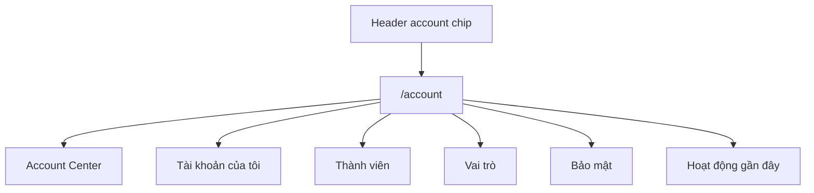

# Plan module Quản lý tài khoản & truy cập PrimeOS

Ngày: 2026-05-04  
Trạng thái: Plan-only, chưa implement  
Agents tham gia: `product-manager`, `api-designer`, `security-auditor`, `ui-designer`  
Nguồn context: screenshot sidebar, `/auth`, `AppLayout`, `AuthContext`, backend demo auth Node/Express.

## Kết luận plan

Không nên build một “Admin mega module” ngay. PrimeOS hiện có auth demo mỏng, role `admin|user`, bearer token stateless, chưa có tenant/session store/audit account. Plan đúng nên đi từ `Account Center` gọn: user hiểu mình là ai, admin quản lý member cơ bản, sau đó mới mở security/session/enterprise.

## Mục tiêu

- User biết tài khoản, workspace, quyền hiện tại.
- Admin mời/deactivate/reactivate member đầu tiên không cần support.
- Backend có nền IAM an toàn: principal, workspace membership, role preset, audit, tenant boundary.
- Không tạo cảm giác có role/session/security enterprise nếu backend chưa support thật.

## Placement / IA

### Quyết định đề xuất

- Entry chính: top-right account chip trong header.
- Route chính: `/account`.
- Không thêm 7 mục con account vào sidebar ở MVP.
- Sidebar giữ vai trò operating areas: Overview, Intelligence, Ecom, Demand, Finance, Customer.
- Sau này nếu đủ surface quản trị mới thêm group `Quản trị`.

### IA trong `/account`



MVP hiển thị toàn bộ như local sections trong một page hoặc subnav cục bộ; không cần route con cho từng tab nếu chưa phức tạp.

## Personas MVP

- `Workspace Admin`: mời/deactivate member, xem ai có quyền gì, giữ workspace an toàn.
- `Operator`: xem hồ sơ/quyền/workspace, cập nhật tên hiển thị.
- `PrimeOS Support/Internal`: persona vận hành nội bộ, không phải UI-first ở MVP.

Không dùng role làm persona. Role là authorization, persona là nhu cầu sử dụng.

## Scope MVP

### Ship Now

- Header account chip: avatar initials, full name/email, role badge, menu.
- `/account` read-only + edit nhẹ:
  - Hồ sơ của tôi: full name editable, email read-only, role, seat/workspace.
  - Workspace summary: name, default locale/timezone, markets nếu có.
  - Thành viên: list cơ bản, invite, deactivate/reactivate admin-only.
  - Vai trò: read-only role presets `Admin / Operator / Viewer`.
  - Security summary: demo-mode warning, password/session roadmap cards nếu chưa làm backend.
- Tests: auth guard, route render, admin-only actions, a11y labels.

### Không ship trong MVP

- Permission matrix full theo domain.
- Active sessions + revoke all devices nếu chưa có session store.
- MFA/SSO/SCIM.
- Custom roles.
- Multi-workspace switcher.
- Account-level locale/timezone sync nếu i18n vẫn local-first.
- Audit log export.

## UX spec

### Header Account Chip

- Desktop: avatar + full name/email + role badge + dropdown chevron.
- Mobile: avatar button only, accessible label đầy đủ.
- Menu:
  - Hồ sơ của tôi
  - Bảo mật
  - Thành viên nếu admin
  - Đăng xuất

### Account Center

- Không mở đầu bằng form dài.
- Card 1: Identity summary.
- Card 2: Workspace summary.
- Card 3: Team summary.
- Card 4: Security recommendations.
- Card 5: Recent activity.

### My Profile

- Desktop 2 cột: identity card read-only + preferences/form.
- Mobile 1 cột.
- Email read-only với helper: “Liên hệ admin để đổi email.”
- Sticky save bar chỉ hiện khi form dirty.

### Team Members

- Desktop table; mobile member cards.
- Toolbar: search, role filter, status filter, CTA `Mời thành viên`.
- Row actions trong menu: resend invite, deactivate, reactivate.
- Empty state: “Chưa có thành viên nào. Mời operator đầu tiên.”

### Roles

- MVP: read-only role cards/preset explorer.
- Role matrix chỉ làm khi backend policy codes hoàn chỉnh.
- Mobile dùng role detail drawer, không dùng bảng ngang.

### Security

- Panel 1: Đăng nhập & mật khẩu.
- Panel 2: Khuyến nghị bảo mật.
- Nếu MFA/session revoke chưa có, hiển thị roadmap card “Sắp có” thay vì disabled control mơ hồ.

### Audit

- MVP: recent activity compact list nếu backend audit có thật.
- Nếu chưa có audit backend, hiển thị security roadmap card, không fake log.

## Backend architecture

Không dùng generic CRUD cho IAM/account. Tạo dedicated account/IAM service.

### Model tối thiểu

```ts
type Principal = {
  id: string;
  email: string;
  display_name: string;
  status: 'active' | 'invited' | 'suspended';
  auth_methods: Array<'password' | 'totp' | 'sso'>;
};

type WorkspaceMembership = {
  id: string;
  workspace_id: string;
  principal_id: string;
  role_key: 'owner' | 'admin' | 'operator' | 'viewer' | 'finance' | 'support';
  seat_type: string | null;
  status: 'active' | 'invited' | 'suspended';
  last_active_at: string | null;
};

type AccountSession = {
  id: string;
  principal_id: string;
  workspace_id: string;
  created_at: string;
  last_seen_at: string;
  expires_at: string;
  revoked_at: string | null;
  ip: string | null;
  user_agent: string | null;
  is_current: boolean;
};

type AccountAuditEvent = {
  id: string;
  workspace_id: string;
  actor_principal_id: string | null;
  session_id: string | null;
  action: string;
  target_type: string;
  target_id: string;
  before: Record<string, unknown> | null;
  after: Record<string, unknown> | null;
  result: 'success' | 'failure';
  request_id: string;
  created_at: string;
};
```

Nguyên tắc: `role_key` authorize; `seat_type` không authorize.

### API draft

Base: `/api/v1`

| Method | Endpoint | Purpose | Permission |
|---|---|---|---|
| GET | `/me` | Current principal + membership + capabilities | authenticated |
| PATCH | `/me` | Update own display profile | `account.profile.update_self` |
| POST | `/me/password` | Change own password | `account.password.change_self` |
| GET | `/workspace` | Workspace account summary | `workspace.read` |
| PATCH | `/workspace` | Update workspace metadata | `workspace.update` |
| GET | `/workspace-members` | List members | `iam.members.read` |
| PATCH | `/workspace-members/:membershipId` | Update role/status metadata | `iam.members.update_role` |
| POST | `/workspace-members/:membershipId/deactivate` | Deactivate member | `iam.members.suspend` |
| POST | `/workspace-members/:membershipId/reactivate` | Reactivate member | `iam.members.reactivate` |
| POST | `/workspace-member-invitations` | Invite member | `iam.members.invite` |
| POST | `/workspace-member-invitations/:id/resend` | Resend invite | `iam.members.invite` |
| GET | `/role-definitions` | Role presets/capabilities | `iam.roles.read` |
| GET | `/audit-events` | Account audit timeline | `iam.audit.read` |
| GET | `/sessions` | Session registry | after session store exists |
| POST | `/sessions/:sessionId/revoke` | Revoke session | after session store exists |

### Error envelope

```json
{
  "error": {
    "code": "iam.member_exists",
    "message": "Member already exists in workspace.",
    "details": [{ "field": "email", "reason": "duplicate" }],
    "request_id": "req_123"
  }
}
```

## RBAC baseline

### Permission codes

- `account.profile.read_self`
- `account.profile.update_self`
- `account.password.change_self`
- `workspace.read`
- `workspace.update`
- `iam.members.read`
- `iam.members.invite`
- `iam.members.update_role`
- `iam.members.suspend`
- `iam.members.reactivate`
- `iam.roles.read`
- `iam.audit.read`
- `iam.sessions.read_self`
- `iam.sessions.revoke_self`
- `iam.sessions.read_workspace`
- `iam.sessions.revoke_workspace`

### Presets MVP

- `Admin`: account/workspace/team management; no owner/billing semantics yet.
- `Operator`: self profile + workspace read.
- `Viewer`: read-only self/workspace.

`Owner`, `Finance`, `Support` để phase sau, trừ khi ICP bắt buộc.

## Security guardrails

- Tenant/workspace boundary phải có trước endpoint account thật.
- Mọi account/IAM resource có `workspace_id`.
- Backend enforce permission; frontend chỉ hỗ trợ UX.
- Last-admin/last-owner guardrail ở command layer.
- Audit append-only cho invite, deactivate, reactivate, role change, password change, session revoke.
- Invite token: hash-only storage, single-use, expiry, email + workspace binding, resend cooldown.
- Demo mode: block ở production/staging, CI/deploy fail nếu `PRIME_ALLOW_DEMO_CREDENTIALS=true`.
- Sessions/password screen chỉ ship khi có session store hoặc ghi rõ là roadmap.
- Nếu giữ bearer in `sessionStorage`, chấp nhận residual XSS risk; nếu chuyển cookie, thêm CSRF policy.

## Migration path

- Giữ `POST /api/auth/login`, `POST /api/auth/logout`, `GET /api/session` như compatibility façade.
- Additive login/session response: thêm `session.id`, `principal`, `membership`, `workspace`, `capabilities` nhưng giữ fields cũ.
- Tạo stores mới: `principals`, `workspace_memberships`, `member_invitations`, `role_definitions`, `account_audit_events`; `sessions` khi làm stateful auth.
- Backfill demo:
  - `login_admin_001` → principal + admin membership.
  - `login_user_001` → principal + operator/viewer membership.
- Chỉ deprecate `resourcePermissions` sau khi `AuthContext` và test helpers dùng shape mới.

## Phase roadmap

### Phase 0 — IAM boundary ADR

- Chốt single vs multi-workspace; vẫn thêm `workspace_id` vào model.
- Chốt bearer vs httpOnly cookie roadmap.
- Chốt roles MVP: `Admin / Operator / Viewer`.
- Viết ADR cho account trust boundary, audit, session limitations.

### Phase 1 — Account Center read-only

- Route `/account` auth-guarded.
- Header account chip + dropdown.
- Read-only profile/workspace/team/security summary từ session safe shape.
- Role preset explorer read-only.
- No sessions revoke, no fake audit.

### Phase 2 — Profile edit

- `GET/PATCH /api/v1/me` additive, không phá `/api/session`.
- Sửa display name.
- Dirty save bar, toast, `role=status/alert`.
- Audit `account.profile.updated`.

### Phase 3 — IAM foundation backend

- Thêm principal/membership/member_invitations/role_definitions/audit_events.
- Policy matrix backend.
- Request id + error envelope.
- Tenant scope enforced.

### Phase 4 — Team members MVP

- Members list/search/filter.
- Invite, resend, deactivate, reactivate.
- Last-admin guardrail.
- Audit bắt buộc.

### Phase 5 — Security + password

- Change password yêu cầu current password.
- Rate limit theo user + IP.
- Rotate session/version; revoke others nếu có store.
- Demo credential hard gates.

### Phase 6 — Sessions + enterprise

- Server-side session registry.
- Revoke current/other/workspace sessions.
- MFA/TOTP, SSO/SAML/OIDC, SCIM.
- Custom roles + domain permission matrix.

## Acceptance criteria

- `100%` account routes auth-guarded.
- `0` sensitive fields leaked: password hash, salt, raw token, invite token.
- `100%` IAM mutations audit event append-only.
- Không thể deactivate/downgrade admin cuối cùng.
- User keyboard-only hoàn thành profile edit + invite flow.
- Account Center usable trên mobile không horizontal scroll.
- Demo mode không thể bật ở staging/production.

## Open decisions

- Entry label cuối cùng: `Tài khoản` hay `Quản lý truy cập`?
- PrimeOS cần multi-workspace ngay không?
- Auth token roadmap: tiếp tục bearer hay chuyển cookie/session store?
- MVP role có cần `Finance` không hay `Admin/Operator/Viewer` đủ?
