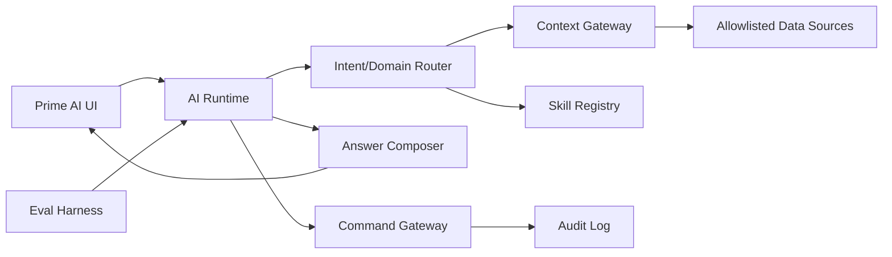

# Plan cải thiện Prime AI

Ngày: 2026-05-04  
Phạm vi: Prime AI / Global Copilot trong PrimeOS main app  
Trạng thái: Plan-only, chưa implement

## Mục tiêu

Cải thiện Prime AI từ trợ lý rule-based hiện tại thành operator copilot đáng tin cậy: hiểu đúng ngữ cảnh trang, trả lời có căn cứ, tạo draft an toàn, có eval/telemetry, sẵn sàng nâng cấp sang LLM/backend mà không phá trust boundary.

## Hiện trạng

- Prime AI hiện chạy chủ yếu ở frontend, deterministic/rule-based.
- Core resolver nằm tại `prime-os-phase-1/app/src/lib/copilot/context.ts`.
- Hook runtime nằm tại `prime-os-phase-1/app/src/hooks/use-global-copilot-engine.ts`.
- UI chat/action nằm trong `prime-os-phase-1/app/src/components/copilot/`.
- Knowledge static nằm tại `prime-os-phase-1/app/src/lib/copilot/knowledge.ts`.
- Test nền đã có: prompt matrix, context resolver, knowledge, hook engine.
- Write flow hiện an toàn theo kiểu draft/prefill, chưa silent mutation.

## Vấn đề chính

- Grounding còn phụ thuộc local store + route, thiếu context gateway chuẩn.
- Citation/freshness/confidence chưa đủ rõ để user tin câu trả lời.
- Clarification còn đơn giản, dễ fallback chung chung.
- Action safety mới dừng ở navigate/copy; confirm/cancel draft chưa hoàn chỉnh.
- Evals mới smoke-level, thiếu golden prompts đa miền/ngôn ngữ/safety.
- Nếu thêm LLM ngay sẽ tăng rủi ro hallucination, secrets leak, bypass policy.

## Nguyên tắc thiết kế

- Local-first trước, LLM sau.
- Read-only mặc định; mọi mutation phải qua draft + confirm + audit.
- Không để frontend giữ quyền business mutation trực tiếp.
- Câu trả lời phải có nguồn, độ mới, entity rõ.
- Ambiguous prompt phải hỏi lại, không đoán quá mức.
- Evals đi trước khi mở rộng năng lực.

## Kiến trúc đích

## Lộ trình phase

### Phase 1 — Context grounding + taxonomy

- Chuẩn hóa domain/intent/entity contract.
- Map route PrimeOS theo Area/Tower/Floor.
- Thêm `source`, `freshness`, `confidenceReason` vào response/debug.
- Tách rõ route context, conversation memory, data snapshot.
- Mở rộng quick prompts theo từng route thực tế.

Kết quả mong muốn: Prime AI hiểu đúng đang ở trang nào, dữ liệu nào được dùng, vì sao chọn intent đó.

### Phase 2 — Response quality + clarification

- Viết response pattern: answer → evidence → next action.
- Giảm generic fallback; thay bằng câu hỏi làm rõ có option.
- Thêm entity citation cho order/product/return/fulfillment.
- Cải thiện follow-up continuity: “đơn này”, “sản phẩm đó”, “case vừa rồi”.
- Chuẩn hóa tone tiếng Việt: ngắn, operator-first, không marketing fluff.

Kết quả mong muốn: câu trả lời cụ thể, có căn cứ, biết hỏi lại khi thiếu dữ kiện.

### Phase 3 — Action safety + draft workflow

- Hoàn thiện `confirm_draft` / `cancel_draft` UI path.
- Thêm draft preview/diff trước khi chuyển trang hoặc submit.
- Gắn risk level + guardrail message cho từng action.
- Không destructive action trực tiếp từ chat.
- Chuẩn bị command schema cho backend gateway sau này.

Kết quả mong muốn: Prime AI hỗ trợ thao tác nhanh nhưng không tự ý ghi dữ liệu nguy hiểm.

### Phase 4 — Evals + telemetry + QA

- Mở rộng `copilot.prompt-matrix.test.ts` thành golden prompt matrix.
- Thêm cases VI/EN, ambiguous prompts, unsafe mutation, hallucinated entity.
- Track fallback rate, clarify rate, intent/domain accuracy.
- Test action URL canonical sau refactor navigation.
- Tạo QA checklist riêng cho Prime AI.

Kết quả mong muốn: mỗi thay đổi bot có regression guard rõ, đo được chất lượng.

### Phase 5 — LLM/backend upgrade có kiểm soát

- Tạo backend AI adapter, không gọi LLM từ frontend.
- Context Gateway read-only trả snapshot/citation/freshness.
- Prompt contract bắt structured JSON output.
- Streaming chỉ phục vụ UX, không là source-of-truth.
- Command Gateway xử lý mutation với RBAC/idempotency/audit.

Kết quả mong muốn: Prime AI có thể dùng LLM thật nhưng vẫn an toàn, traceable, testable.

## Metrics thành công

- Intent/domain accuracy ≥ 90% trên golden prompt matrix.
- Grounded answer rate ≥ 95% có citation/source/freshness.
- Unsafe mutation bypass = 0.
- Clarify rate 10–25% với prompt mơ hồ.
- Hallucinated entity/action ≤ 1% trong eval set.
- P95 response < 2.5s cho rule/read-only; < 6s cho LLM/tool flow.
- Task completion tăng ≥ 20% cho product/order/inventory workflows.

## Rủi ro

- Thêm LLM quá sớm → hallucination, khó debug.
- Chat-first quá mạnh → user rời khỏi workflow chính.
- Frontend mutation → bypass policy.
- Memory chứa PII → cần retention/redaction/encryption trước khi lưu lâu dài.
- Scope creep đa agent → nên bắt đầu 1 tower, 1 flow, 1 command.

## Khuyến nghị thực thi

Bắt đầu bằng Phase 1 và Phase 4 song hành nhẹ: chuẩn hóa grounding contract, đồng thời thêm eval cases để khóa behavior. Chưa nên thêm LLM ở sprint đầu; cần làm trust boundary + eval trước.

## Câu hỏi mở

- Prime AI ưu tiên tower nào đầu tiên: Product, Orders, Inventory hay Demand Campaigns?
- Có yêu cầu lưu conversation history thật không, hay chỉ session-local?
- Backend hiện tại đã có endpoint audit/command phù hợp chưa?
