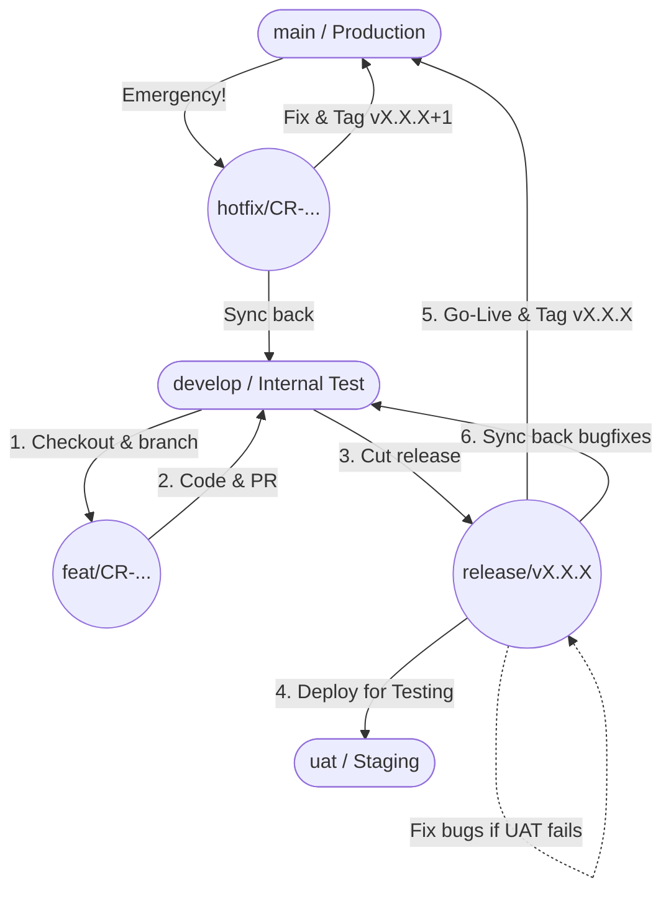

# 📘 STANDARD GITFLOW DOCUMENTATION - ECH-KENSHIN PROJECT

## 1. Core Branches (Environment mapping)

The project maintains three long-lived branches corresponding directly to our deployment environments. **Direct pushes to these branches are strictly prohibited.** All changes must go through a Pull Request (PR).

* **`main` (Production):** The source of truth for the live environment. Code here is completely stable and always associated with a Git Tag (e.g., `v1.0.0`).
* **`uat` (Staging / UAT):** The testing ground for PMs, BAs, and Stakeholders. Receives code from `release` branches.
* **`develop` (Development):** The heart of the project. QA and internal testing happen here. All feature branches branch off from and merge back into `develop`.

## 2. Branch Naming Conventions

Every branch must include the **Task ID** to ensure full traceability across our CI/CD pipeline and issue tracker.

* **Feature:** `feat/[Task-ID]-[short-description]` (e.g., `feat/CR-101-amazon-ingest`)
* **Bugfix (In-Sprint):** `fix/[Task-ID]-[short-description]` (e.g., `fix/CR-105-login-crash`)
* **Epic (Large, multi-dev features):** `epic/[Task-ID]-[epic-name]` (e.g., `epic/CR-200-multi-tenant`)
* **Hotfix (Production emergency):** `hotfix/[Task-ID]-[short-description]` (e.g., `hotfix/CR-911-payment-fail`)

## 3. GitFlow Visualized (Flowchart)



## 4. The Developer Workflow (Daily Operations)

When picking up a Task from Base Lark, follow this exact sequence:

**Step 1: Sync with the latest `develop` branch**

```bash
git checkout develop
git pull origin develop

```

**Step 2: Create your working branch**

```bash
git checkout -b feat/CR-123-setup-aws-kms

```

**Step 3: Commit your code**
*Note: Code must pass Biome Linter strict modes (Husky pre-commit hooks will block invalid formatting).*

```bash
git add .
git commit -m "feat(auth): integrate AWS KMS for secret encryption (CR-123)"

```

**Step 4: Push and open a Pull Request (PR)**

```bash
git push origin feat/CR-123-setup-aws-kms

```

* Open a PR targeting the `develop` branch.
* **Assign Reviewers:** You must assign **at least 1 Peer Reviewer** (another developer from your domain, e.g., FE assigns FE, BE assigns BE) AND the **Tech Lead/SA**.
* **Merge Condition:** The PR can ONLY be merged when it has **2 Approvals** (1 Peer + 1 SA) AND a green CI pipeline (Lint/Test passed).

## 5. Release & Go-Live Process (For Tech Lead / SA)

When a Sprint ends or Phase 1 is ready for delivery, the Lead will execute the following to promote code:

**Step 1: Cut the Release Branch**

```bash
git checkout develop
git pull origin develop
git checkout -b release/v1.0.0

```

**Step 2: UAT Deployment & Testing**

* Open a PR from `release/v1.0.0` into `uat`.
* If bugs are found during UAT, developers create `fix/...` branches directly from `release/v1.0.0`, and merge them back into the release branch.

**Step 3: Production Go-Live**

* Open a PR from `release/v1.0.0` into `main`.
* Once merged, tag the commit to trigger the Production deployment pipeline and auto-generate the Changelog:

```bash
git checkout main
git pull origin main
git tag v1.0.0
git push origin v1.0.0

```

**Step 4: Cleanup & Sync**

* Merge `release/v1.0.0` back into `develop` to ensure the dev environment receives all UAT bugfixes.
* Delete the `release/v1.0.0` branch.

## 6. Hotfix Process (Production Emergencies)

If a critical issue occurs on Production (`main`), **never fix it from `develop`.**

1. Branch directly from `main`: `git checkout -b hotfix/CR-911-fix-crash main`
2. Fix the bug and test thoroughly locally.
3. Open **Two Pull Requests**:
* **PR 1:** Merge `hotfix/...` into `main` (To rescue Prod immediately). Tag the new version (e.g., `v1.0.1`).
* **PR 2:** Merge `hotfix/...` into `develop` (To ensure the bug doesn't reappear in future releases).


4. Delete the hotfix branch.

## 7. The Golden Rules

1. **No Direct Commits:** Pushing directly to `main`, `uat`, or `develop` is blocked at the repository level.
2. **Rebase/Merge locally before PR:** If `develop` has progressed while you were working, pull the latest `develop` into your feature branch and resolve conflicts *before* asking for a review.
3. **Draft PRs:** Use Draft PRs (or prepend `[WIP]`) to push early and gather architectural feedback before the code is fully finished.

### 8. Code Review Culture (Peer Review + SA Gatekeeper)

To empower the team while ensuring top-tier code quality, we employ a **Two-Tier Code Review System**. Everyone is responsible for code quality, but we look for different things.

#### Tier 1: The Peer Reviewer (Your Teammate)

When you are tagged to review a teammate's PR, you are the first line of defense. Focus on the "surface and logic":

* **Readability & Clean Code:** Are variables named clearly? Is the code easy to understand? Are there any hardcoded values?
* **Business Logic:** Does the code satisfy the task acceptance criteria? Did they handle edge cases (e.g., null values, empty arrays)?
* **UI/UX (Frontend):** Does the component match the design specs? Are the design tokens used correctly? Is it responsive?
* *Goal:* Catch silly mistakes, typos, and logic flaws early. Feel free to ask questions and learn from your teammate's code.

#### Tier 2: The Tech Lead / SA (The Gatekeeper)

The SA will do the final review before merging. The SA trusts the Peer Reviewer for typos and basic logic, and will strictly focus on the "core engine":

* **Architecture & Patterns:** Does the code violate the Monorepo structure? Is the Outbox Pattern implemented correctly?
* **Performance:** Are there any N+1 query issues? Are we missing database indexes? Are React components re-rendering unnecessarily?
* **Security & Multi-tenancy:** *Crucial check.* Is the PostgreSQL RLS applied? Are we exposing sensitive Amazon API keys? Is the `org_id` context handled correctly?
* *Goal:* Ensure the system is highly scalable, secure, and doesn't accumulate technical debt.
